# Modul Praktikum Penambangan Data – Teknologi Rekayasa Perangkat Lunak – 2025
## PERTEMUAN X: MODEL DEPLOYMENT (FLASK)

### 10.1 TUJUAN PEMBELAJARAN
A. Mahasiswa mampu memahami konsep dasar *model deployment* dalam siklus hidup *data mining* (*ML Lifecycle*).  
B. Mahasiswa mampu melakukan *serialization* (penyimpanan) dan *deserialization* (pemuatan kembali) model *machine learning* menggunakan pustaka `joblib` atau `pickle`.  
C. Mahasiswa dapat membangun layanan web (*Web Service*) sederhana menggunakan micro-framework Flask.  
D. Mahasiswa dapat mengintegrasikan model *machine learning* ke dalam antarmuka API/Web sehingga dapat menerima input data baru dari pengguna dan menyajikan hasil inferensi prediksi secara interaktif.  

---

### 10.2 DASAR TEORI

**• Tahapan Pengembangan Machine Learning**  
Pengembangan model *machine learning* bukanlah proses sekali jalan, melainkan sebuah siklus iteratif (*ML Pipeline / Lifecycle*). Tahapan komprehensifnya meliputi *Problem Definition*, *Data Collection*, *Data Preparation*, *Exploratory Data Analysis*, *Feature Engineering*, *Model Training*, *Model Evaluation & Tuning*, hingga tahap akhir yaitu **Model Deployment** dan *Monitoring*.

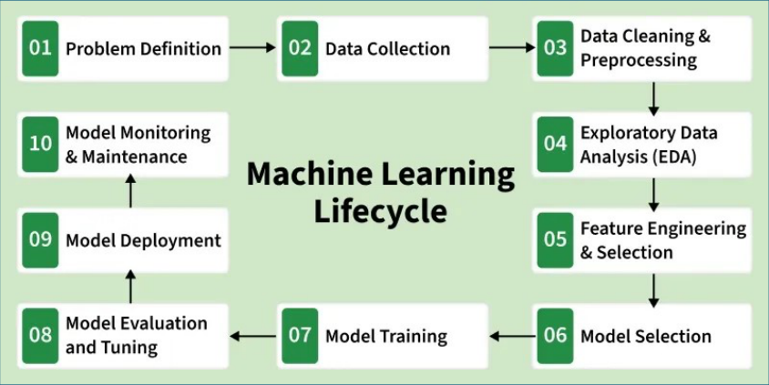  
*Gambar 10.2.1 Machine Learning Lifecycle (Sumber: www.geeksforgeeks.org)*

Pada pertemuan-pertemuan sebelumnya, proses telah mencapai tahap evaluasi model. Namun, model yang dihasilkan masih berada di lingkungan komputasi lokal pengembang dan belum dapat dimanfaatkan oleh sistem lain atau pengguna akhir. Pertemuan ini berfokus pada tahap **Model Deployment**.

**• Model Deployment**  
*Deployment* mentransformasikan model statis menjadi sebuah layanan komputasi aktif. Beberapa skema deployment antara lain: *embedded model* (tertanam langsung di aplikasi), *batch prediction*, dan arsitektur *client-server* berbasis RESTful API. Praktikum ini menggunakan skema **client-server**, di mana antarmuka pengguna berkomunikasi dengan server inferensi melalui protokol HTTP.

Alur data pada skema *client-server*:
1. **Flask sebagai Web Service**: Menyediakan rute URL (endpoint) yang dapat diakses pengguna.
2. **API Endpoint**: Menerima request berisi fitur masukan dari form web atau request JSON.
3. **Web Server (Flask Controller)**: Melakukan parsing, validasi, dan transformasi bentuk data agar sesuai dengan spesifikasi input matriks model.
4. **Model Loading & Inference**: Menggunakan model biner yang telah dimuat ke memori untuk menghitung prediksi output.
5. **Response**: Mengirimkan hasil prediksi kembali ke sisi klien berupa tampilan halaman HTML (*render template*) atau respons JSON.

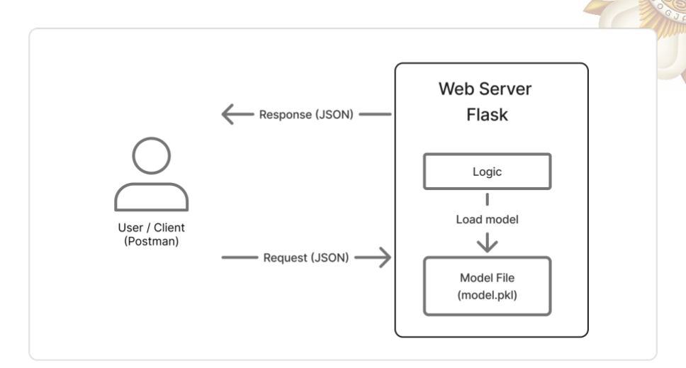  
*Gambar 10.2.2 Skema alur data client-server*

**• Flask Framework**  
Flask adalah sebuah *micro web framework* berbasis Python yang ringan, fleksibel, dan tidak memaksakan dependensi bawaan seperti ORM secara kaku. Karakteristik ini membuat Flask sangat ideal untuk membangun API layanan *machine learning* dengan waktu pengembangan yang cepat.

  
*Gambar 10.2.3 Logo Flask*

**• Model Serialization**  
Model yang dilatih di memori RAM akan hilang saat runtime Python berakhir. *Serialization* adalah proses mengubah objek model Python di memori menjadi representasi biner yang dapat disimpan ke dalam media penyimpanan fisik (misalnya file `.pkl` atau `.model`). Sebaliknya, *deserialization* adalah proses memuat kembali file biner tersebut ke objek memori tanpa perlu melatih ulang model dari awal. Pustaka standar yang digunakan adalah `joblib` (sangat optimal untuk model dengan array NumPy besar) atau `pickle`.

---

### 10.3 ALAT DAN BAHAN

**• Perangkat Keras**  
- Komputer / Laptop  

**• Perangkat Lunak**  
- Python 3.10+ (disarankan menggunakan Linux / WSL2)  
- Text Editor / IDE (VS Code, Cursor, PyCharm). *Catatan: Tidak disarankan menjalankan server Flask di dalam notebook Jupyter.*  
- Postman / cURL (opsional, untuk pengujian endpoint API)  

**• Pustaka Python**  
- `flask`  
- `scikit-learn`  
- `pandas`  
- `numpy`  
- `joblib`  
- `tensorflow` (opsional untuk model berbasis neural network)  

---

### 10.4 LANGKAH PERCOBAAN

Praktikum ini membangun aplikasi web deteksi penyakit hati (*Liver Disease Classification*) menggunakan model *Decision Tree*.

#### 1. Persiapan Direktori & Dataset
Unduh file proyek dan dataset pendukung melalui tautan Google Drive:  
`https://drive.google.com/file/d/1R5vXlI015dJ0s3HYbZMvvBdcM3E6VVh2/view?usp=sharing`

Struktur folder yang disiapkan mencakup folder pelatihan model dan folder aplikasi web:
- `flask/create_model/tabular`
- `flask/web/tabular_v2`

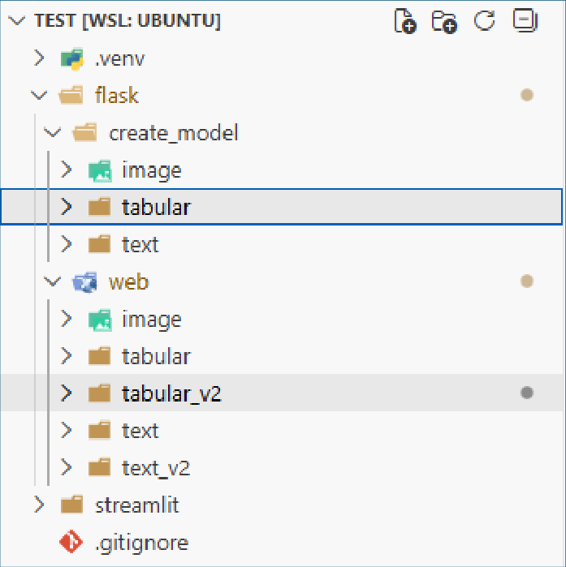  
*Gambar 10.4.1 Folder yang perlu disalin*

Instal pustaka yang dibutuhkan:
```bash
pip install flask numpy scikit-learn pandas joblib
```

#### 2. Pelatihan dan Serialisasi Model Machine Learning
Melakukan pra-pemrosesan data tabular pasien penyakit hati:

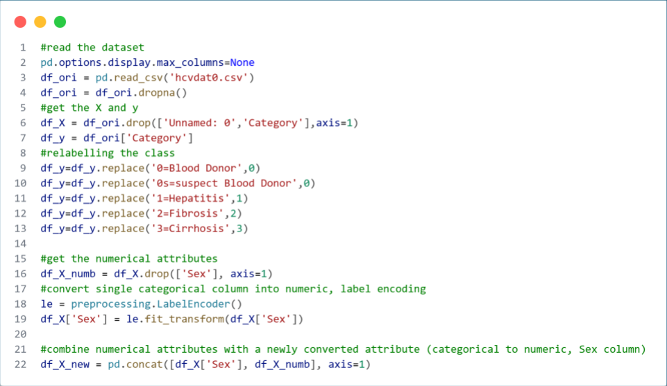  
*Gambar 10.4.2 Preprocessing Dataset*

Membangun dan melatih model `DecisionTreeClassifier`:

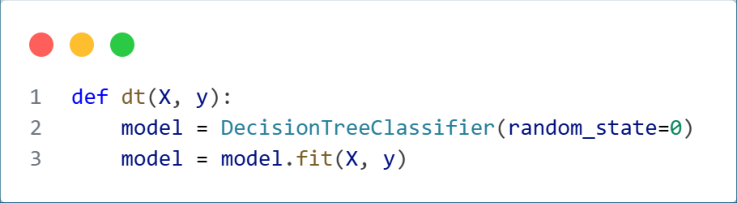  
*Gambar 10.4.3 Decision Tree Model*

Menyimpan model ke dalam file serialisasi biner (`dt_model.model`) menggunakan pustaka `joblib`:

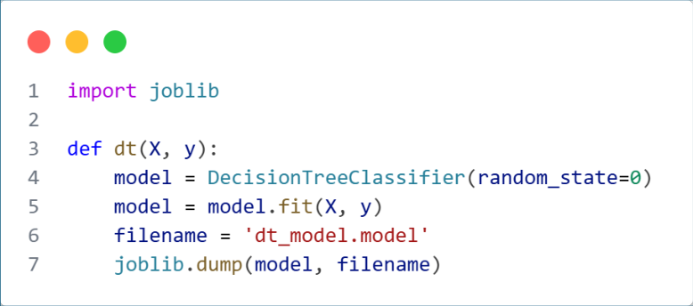  
*Gambar 10.4.4 Menyimpan model hasil training*

Berikut adalah kode utuh skrip pelatihan dan serialisasi model (`train.py`):

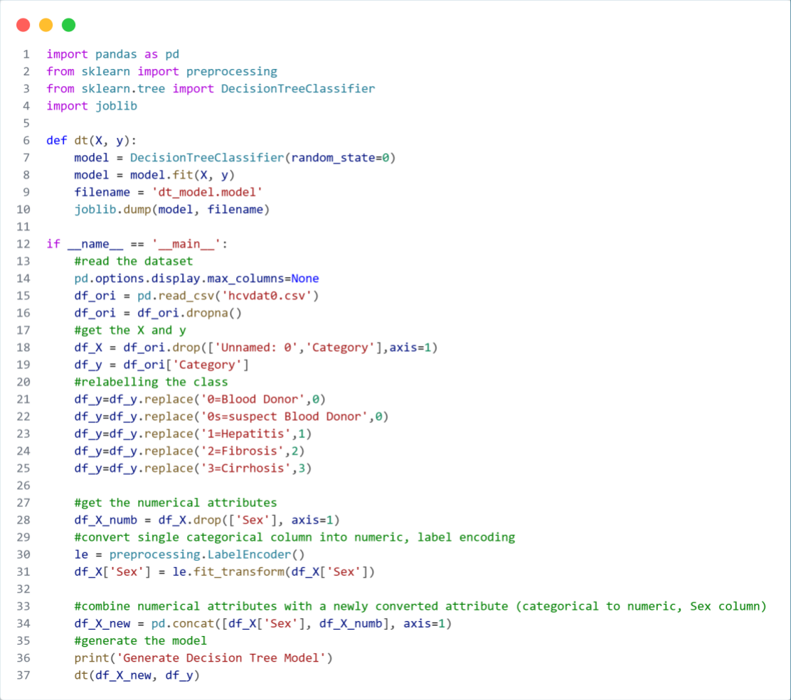  
*Gambar 10.4.5 Pembuatan Model DT Liver*

Menjalankan skrip Python pembuatan model melalui terminal:

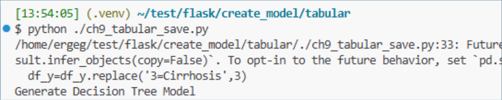  
*Gambar 10.4.6 Menjalankan script python*

File model `dt_model.model` berhasil dibangkitkan dan siap disalin ke direktori aplikasi web:

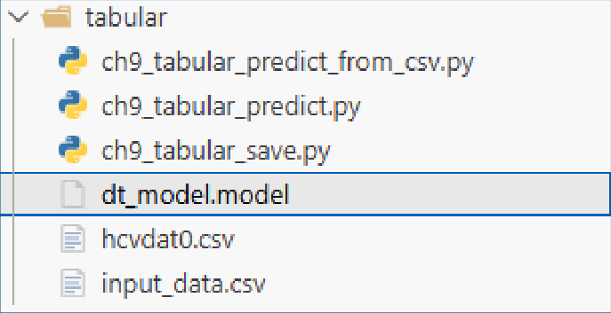  
*Gambar 10.4.7 File yang perlu disalin*

#### 3. Pembuatan Web Service Flask
Mengimpor modul Flask, `render_template`, `request`, serta pustaka `joblib`:

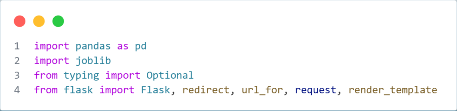  
*Gambar 10.4.8 Pustaka Deployment Flask*

Mendefinisikan aplikasi Flask minimal dan endpoint route `/tabular/` yang merender halaman form antarmuka `index.html`:

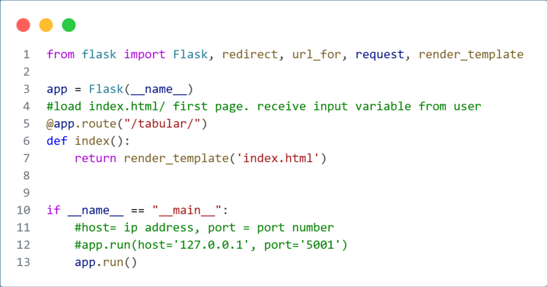  
*Gambar 10.4.9 Minimal Flask Application*

#### 4. Integrasi Model dan Endpoint Prediksi
Membangun rute inferensi HTTP POST yang bertugas:
1. Membaca nilai masukan fitur dari form web (`request.form`).
2. Mengonversi data ke tipe numerik/vektor NumPy.
3. Memanggil model `dt_model.model` yang telah dimuat untuk melakukan inferensi: `model.predict()`.
4. Mengirimkan label status prediksi ke halaman template `result.html`.

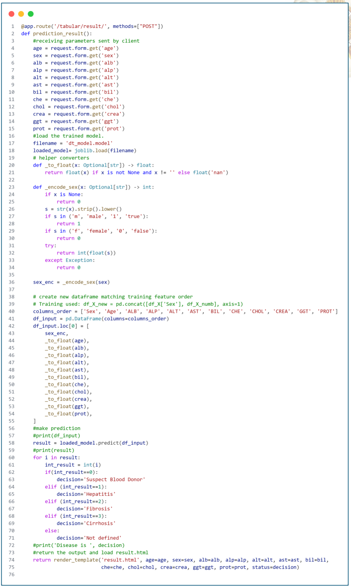  
*Gambar 10.4.10 Endpoint Prediksi (tabular_api.py)*

Struktur file lengkap pada proyek aplikasi Flask:

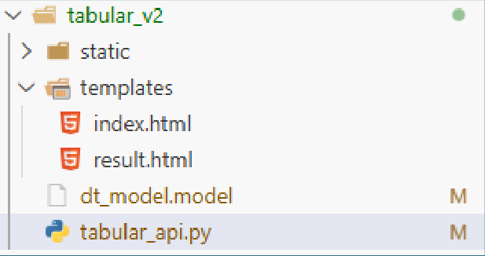  
*Gambar 10.4.11 Struktur Proyek Flask*

#### 5. Menjalankan Server Flask & Pengujian
Menjalankan server web Flask melalui antarmuka WSGI lokal:

```bash
python tabular_api.py
```

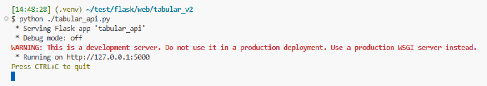  
*Gambar 10.4.12 Menjalankan Flask*

Buka peramban web pada alamat `http://127.0.0.1:5000/tabular`. Form input data klinis akan tertampil:

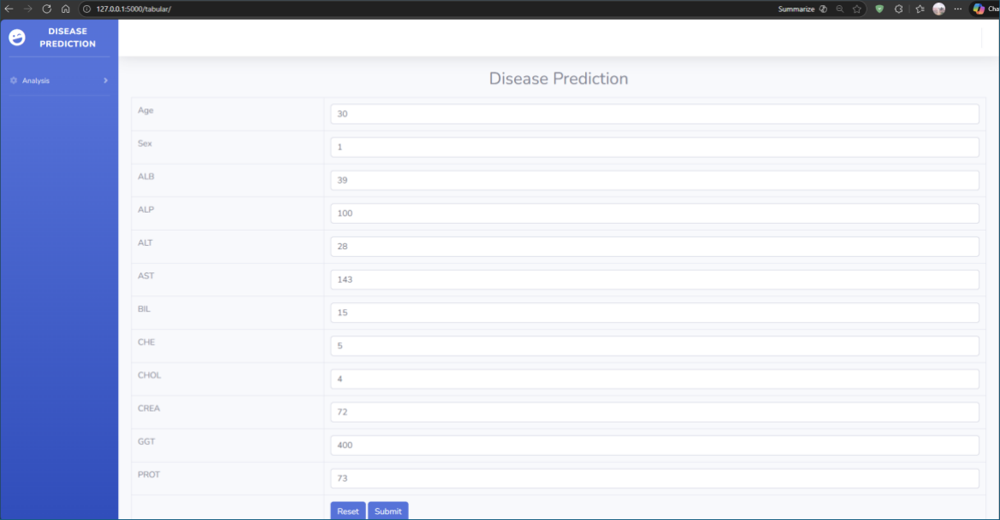  
*Gambar 10.4.13 Endpoint Tabular*

Isi form dengan parameter uji lalu tekan tombol **Submit**. Halaman hasil prediksi dari model Machine Learning akan ditampilkan:

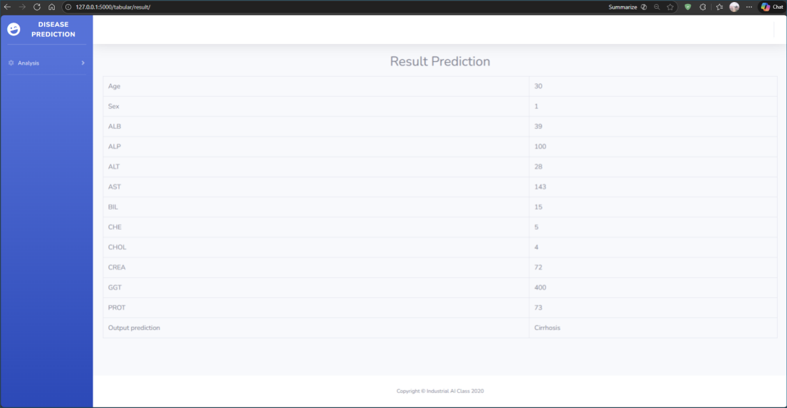  
*Gambar 10.4.14 Endpoint Result Tabular*

---

### 10.5 TUGAS & ANALISIS
Silakan menggunakan dataset dari proyek kelompok Anda untuk melakukan pelatihan model Machine Learning. Lakukan serialisasi pada model terbaik yang diperoleh, kemudian bangun layanan antarmuka web interaktif menggunakan framework Flask untuk mendemokan hasil prediksi. Susun laporan praktikum lengkap sesuai format yang telah ditentukan.

---

### 10.6 REFERENSI
- Dokumentasi Resmi Flask: https://flask.palletsprojects.com/en/stable/
- Panduan Instalasi dan Deployment Flask: https://flask.palletsprojects.com/en/stable/deploying/
- Han, J., Pei, J., & Tong, H. (2022). *Data Mining: Concepts and Techniques* (4th ed.). Morgan Kaufmann/Elsevier.
- Dokumentasi Scikit-Learn (Model Persistence): https://scikit-learn.org/stable/model_persistence.html
- Dokumentasi Python Virtual Environments: https://packaging.python.org/en/latest/guides/installing-using-pip-and-virtual-environments/
