# Modul Praktikum Penambangan Data – Teknologi Rekayasa Perangkat Lunak – 2025
## PERTEMUAN XI: MODEL DEPLOYMENT (STREAMLIT)

### 11.1 TUJUAN PEMBELAJARAN
A. Memahami perbedaan paradigma *deployment* antara *Web Service* (Flask) dan *Data Application* (Streamlit).  
B. Menggunakan pustaka Streamlit untuk membuat antarmuka web interaktif berbasis Python tanpa memerlukan kode front-end (HTML/CSS/JavaScript) terpisah.  
C. Membuat berbagai *input widgets* (formulir, *slider*, *selectbox*, *number input*) untuk menerima data inferensi dari pengguna.  
D. Mengintegrasikan model *machine learning* ke dalam dashboard interaktif untuk melakukan inferensi prediksi secara visual dan *real-time*.  

---

### 11.2 DASAR TEORI

**• Mengenal Streamlit**  
Streamlit adalah framework Python *open-source* yang dirancang khusus bagi *Data Scientist* dan *Machine Learning Engineer* untuk membangun aplikasi web dan dashboard data yang interaktif secara instan.  
Berbeda dengan Flask yang memerlukan perancangan arsitektur rute (*routing*) dan berkas templat HTML/CSS tersendiri, Streamlit secara cerdas mengubah skrip Python analisis data langsung menjadi aplikasi web yang siap pakai. Setiap kali pengguna berinteraksi dengan widget (misalnya menggeser *slider* atau memilih menu), Streamlit mengeksekusi ulang (*rerun*) skrip dari baris awal ke akhir untuk memperbarui tampilan antarmuka secara dinamis.

**• Perbedaan Flask dan Streamlit**  
Meskipun keduanya dapat digunakan untuk menyajikan model machine learning melalui web, filosofi desain dan arsitektur dasarnya berbeda:

1. **Filosofi Pengembangan:**  
   - **Flask**: Memberikan kendali penuh pada pengembang dalam merancang struktur URL (*routing*), templat HTML, dan manajemen request/response HTTP. Sangat cocok untuk membangun backend RESTful API produksi yang akan dikonsumsi oleh aplikasi klien lain (mobile, web SPA).  
   - **Streamlit**: Mengutamakan kecepatan iterasi dan kesederhanaan. Kompleksitas pemrograman web disembunyikan di balik fungsi Python modular. Sangat cocok untuk *rapid prototyping*, visualisasi eksploratif, dan dashboard data internal.

2. **Arsitektur Eksekusi:**  
   - **Flask**: Menggunakan arsitektur berbasis *Request-Response*. Logika dieksekusi hanya saat sebuah endpoint spesifik dipanggil melalui metode HTTP. Variabel lokal di memori request akan musnah setelah respons terkirim.  
   - **Streamlit**: Menggunakan arsitektur berbasis *Script Re-run*. Setiap interaksi pengguna memicu eksekusi ulang skrip dari baris pertama hingga terakhir. Untuk mencegah komputasi berat dijalankan berulang kali, Streamlit menyediakan mekanisme *Session State* dan *Caching*.

| Fitur | Flask | Streamlit |
| :--- | :--- | :--- |
| **Fokus Utama** | Backend API & Web Development Umum | Data Dashboard & Prototyping Cepat |
| **Front End** | Perlu HTML / CSS / JavaScript manual | Otomatis ter-generate dari skrip Python |
| **Fleksibilitas** | Sangat Tinggi | Terfokus pada pola Data Application |
| **Target Pengguna** | Developer aplikasi lain & sistem backend | *End-User* & Analis Bisnis |

**• Komponen Utama Streamlit**  
1. **Output & Text Display:**  
   - `st.write()`: Fungsi serbaguna untuk mencetak teks, DataFrame, dictionary, objek model, hingga grafik secara otomatis.  
   - `st.title()`, `st.header()`, `st.subheader()`: Menampilkan hierarki judul.  
   - `st.markdown()`: Menampilkan teks berformat Markdown (cetak tebal, miring, tautan, rumus LaTeX).  
   - `st.metric()`: Menampilkan metrik angka penting dengan indikator delta kenaikan/penurunan.
2. **Input Widgets:**  
   - `st.text_input()`, `st.number_input()`: Menerima masukan teks atau numerik secara manual.  
   - `st.slider()`, `st.select_slider()`: Memilih nilai dalam rentang tertentu.  
   - `st.selectbox()`, `st.multiselect()`: Menyajikan menu pilihan *dropdown*.  
   - `st.file_uploader()`: Mengunggah berkas eksternal (CSV, citra, teks).  
   - `st.form()` & `st.form_submit_button()`: Mengelompokkan sejumlah input agar tidak memicu *rerun* sebelum tombol submit ditekan.
3. **Layouts & Containers:**  
   - `st.sidebar`: Menempatkan elemen input pada bilah samping agar area utama tetap bersih.  
   - `st.columns()`: Membagi tata letak menjadi beberapa kolom sejajar.  
   - `st.tabs()`: Membuat navigasi berbasis tab dalam satu tampilan.  
   - `st.expander()`: Menyediakan wadah konten yang dapat dibuka-tutup (*collapsible container*).
4. **Caching (Optimasi Performa):**  
   Karena Streamlit menjalankan ulang skrip pada setiap interaksi, proses yang memakan waktu lama—seperti memuat model machine learning atau membaca dataset besar—akan memperlambat performa jika tidak dioptimasi.  
   Dekorator `@st.cache_resource` digunakan untuk menyimpan objek global (seperti model ML, koneksi database) di dalam memori cache sehingga proses inisialisasi hanya dijalankan satu kali saja.

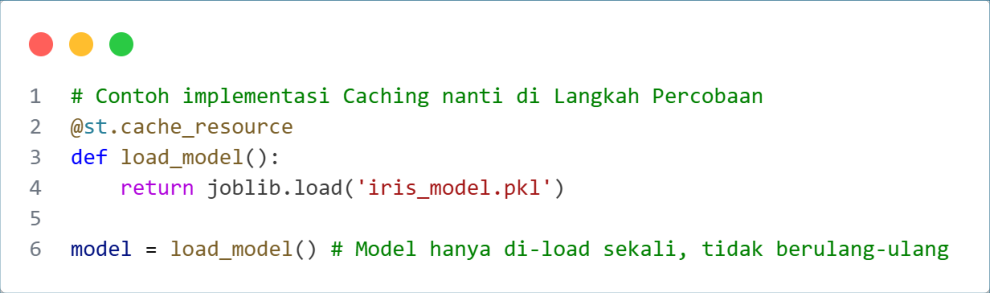  
*Gambar C.1 Contoh penggunaan dekorator st.cache_resource*

---

### 11.3 ALAT DAN BAHAN

**• Perangkat Keras**  
- Laptop / Komputer  

**• Perangkat Lunak**  
- Python 3.10+  
- Text Editor / IDE (VS Code, Cursor, PyCharm)  
- Web Browser  

**• Pustaka Python**  
- `streamlit`  
- `pandas`  
- `numpy`  
- `joblib`  
- `scikit-learn`  

---

### 11.4 LANGKAH PERCOBAAN

Praktikum ini membangun antarmuka dashboard interaktif menggunakan Streamlit untuk memprediksi risiko penyakit hati menggunakan model serialisasi yang telah dibuat pada pertemuan sebelumnya (`dt_model.model`).

#### 1. Instalasi Pustaka
Instalasi pustaka Streamlit dan dependensi pendukung:
```bash
pip install streamlit pandas joblib scikit-learn
```

#### 2. Struktur Proyek
Buat berkas skrip Python bernama `app.py`. Pastikan berkas model serialisasi (`dt_model.model`) diletakkan pada direktori yang sama dengan `app.py`:

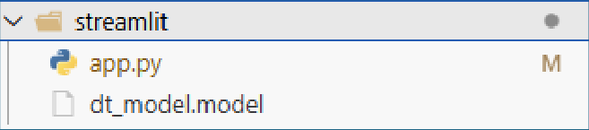  
*Gambar 11.3.1 Struktur Proyek Praktikum Streamlit*

#### 3. Menjalankan Server Aplikasi Streamlit
Jalankan aplikasi melalui terminal menggunakan perintah:
```bash
streamlit run app.py
```

Jika server berhasil aktif, terminal akan menampilkan alamat URL lokal (`http://localhost:8501`):

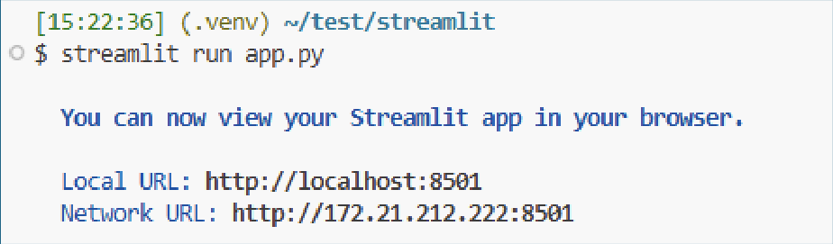  
*Gambar 11.3.2 Aplikasi Streamlit berhasil dijalankan*

#### 4. Menambahkan Konfigurasi Halaman, Judul, dan Keterangan
Konfigurasi dasar antarmuka web diatur menggunakan fungsi `set_page_config`, `title`, dan `caption` pada awal berkas `app.py`:

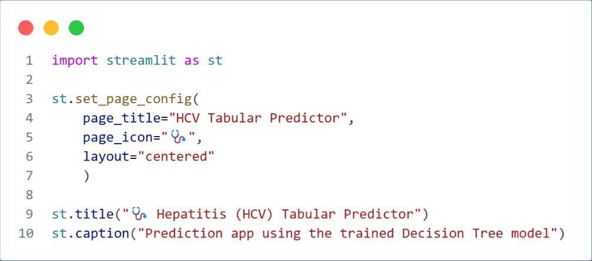  
*Gambar 11.3.3 Menambahkan Konfigurasi Web, Title, Caption*

Tampilan judul dan keterangan pada peramban web:

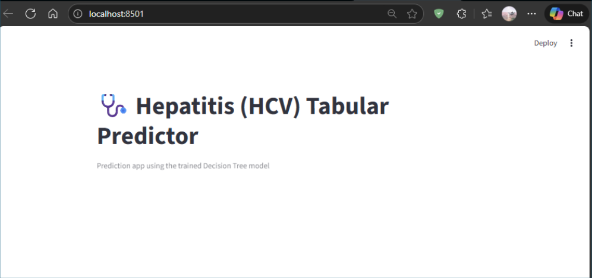  
*Gambar 11.3.4 Halaman yang tertampil di Streamlit*

#### 5. Mendesain Tata Letak Dasar (Columns)
Membagi area tampilan menjadi dua kolom sejajar menggunakan `st.columns(2)`:

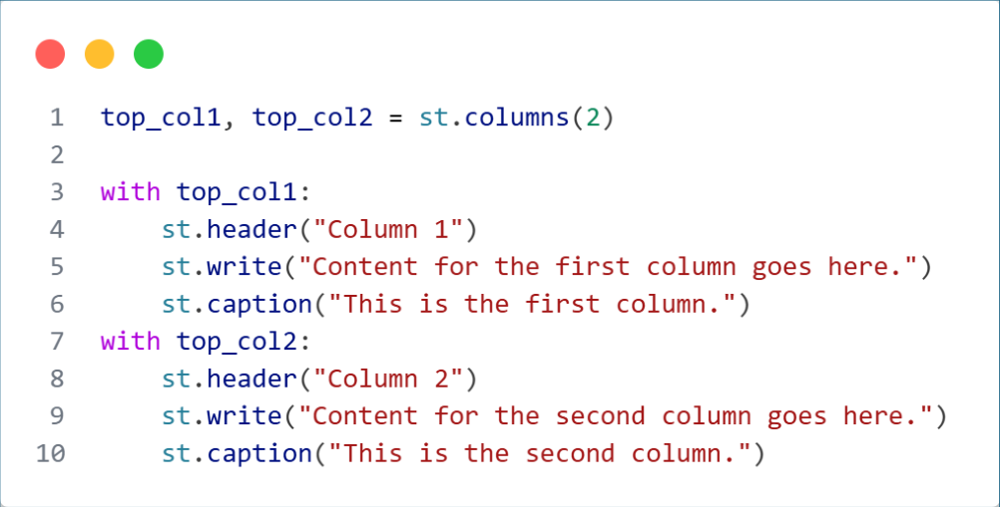  
*Gambar 11.3.5 Layouting 2 kolom*

Hasil tata letak 2 kolom di peramban:

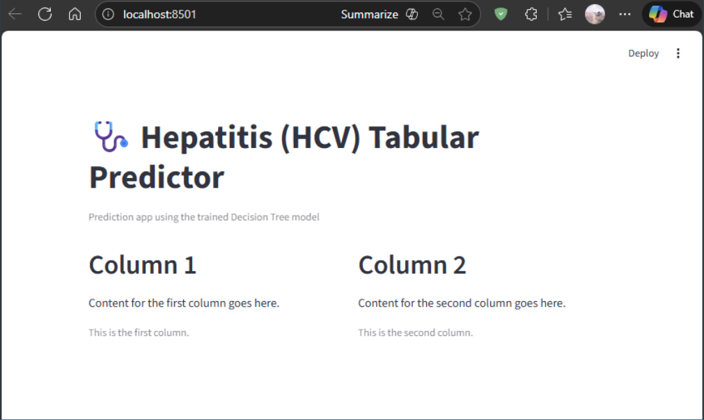  
*Gambar 11.3.6 Hasil layouting 2 kolom*

#### 6. Menambahkan Sidebar
Menempatkan kontrol informasi atau panduan pada bilah samping (*sidebar*) menggunakan `st.sidebar`:

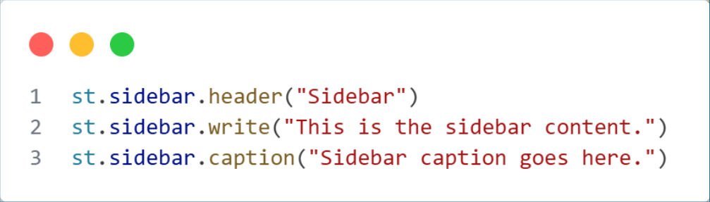  
*Gambar 11.3.7 Kode Streamlit Sidebar*

Tampilan sidebar pada antarmuka Streamlit:

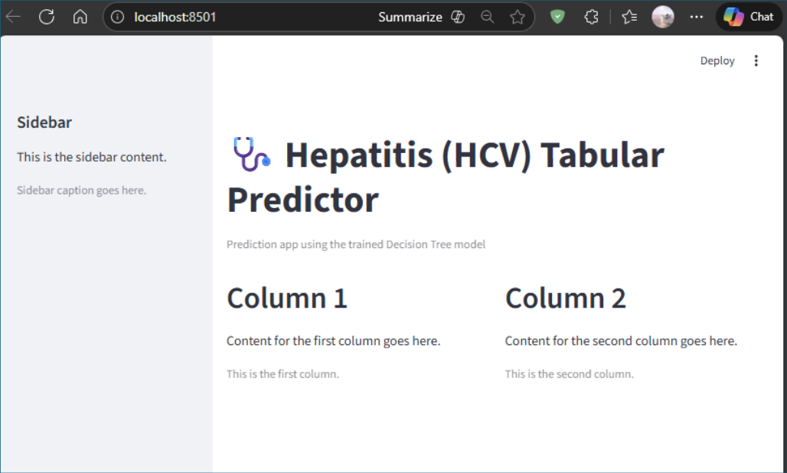  
*Gambar 11.3.8 Halaman Streamlit diberikan sidebar*

#### 7. Integrasi Model Machine Learning
1. Mendefinisikan jalur berkas model:

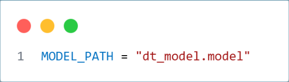  
*Gambar 11.3.9 Model Path*

2. Memuat model machine learning secara efisien memanfaatkan dekorator `@st.cache_resource`:

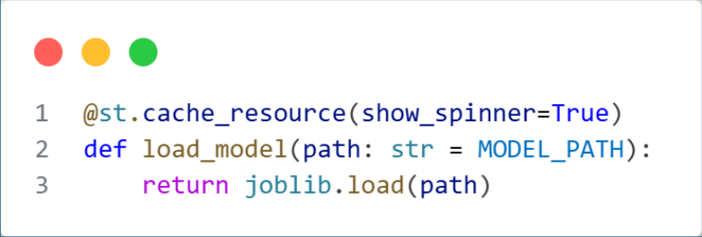  
*Gambar 11.3.10 Load model dengan cache*

3. Mengelola state aplikasi (*Session State*) dan mendefinisikan nilai *default* untuk formulir input:

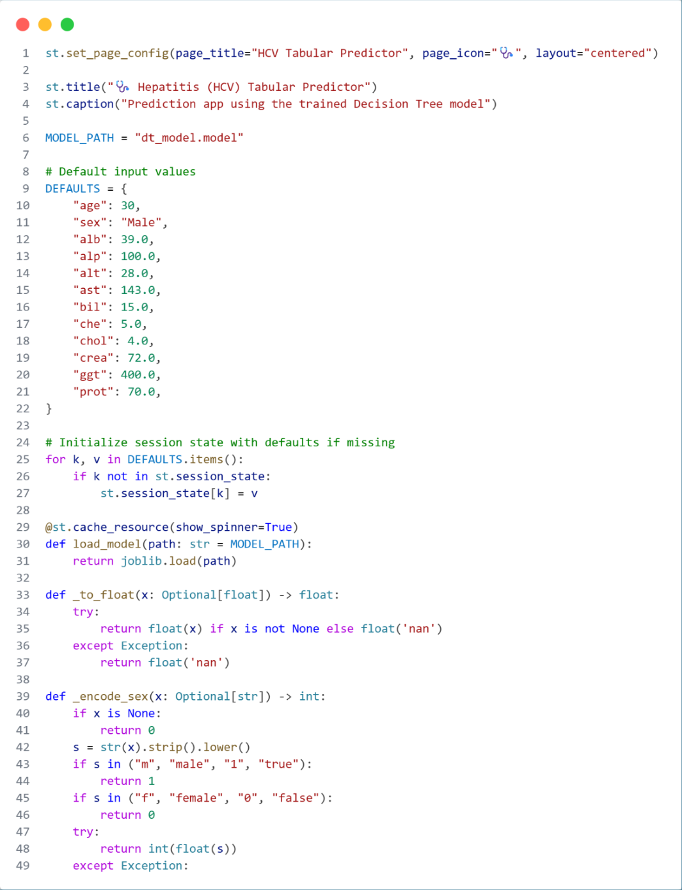  
*Gambar 11.3.11 Manajemen State dan Fungsi bantuan*

4. Menambahkan tombol reset formulir ke nilai *default*:

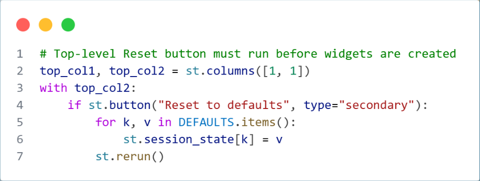  
*Gambar 11.3.12 Tombol Reset Formulir*

5. Membangun formulir masukan fitur menggunakan `st.form`:

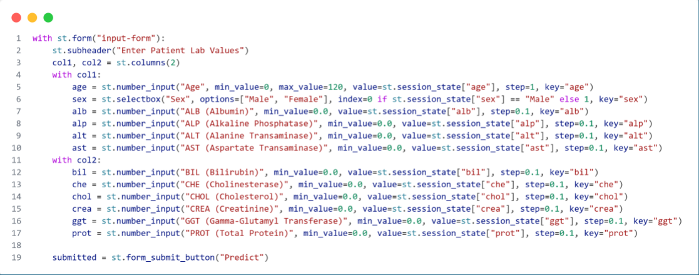  
*Gambar 11.3.13 Kode Formulir Streamlit*

6. Mengolah logika inferensi model saat tombol formulir ditekan, disertai indikator loading (`st.spinner`):

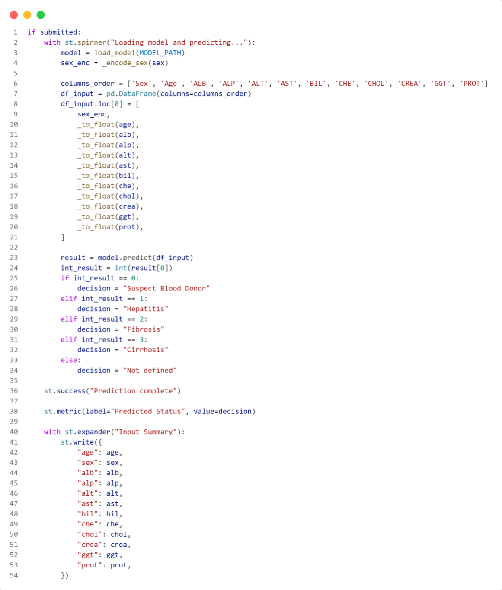  
*Gambar 11.3.14 Halaman Output Prediksi*

7. Tampilan formulir masukan (*input form*):

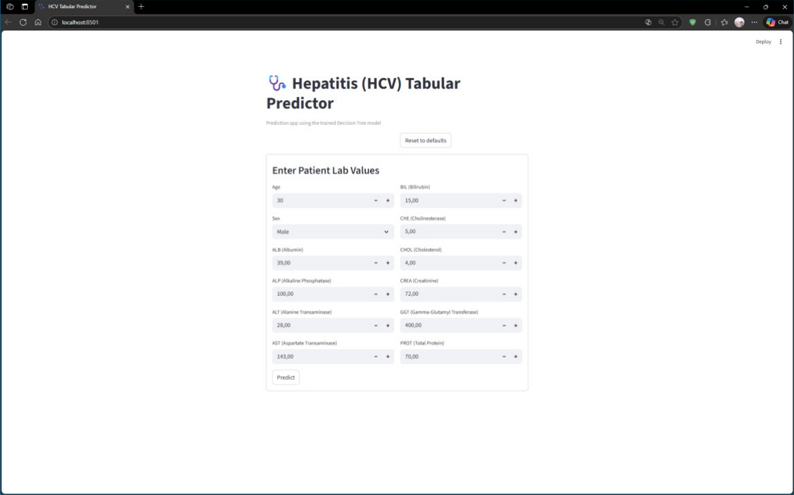  
*Gambar 11.3.15 Halaman Input*

8. Tampilan menyeluruh formulir masukan dan hasil prediksi model pada dashboard:

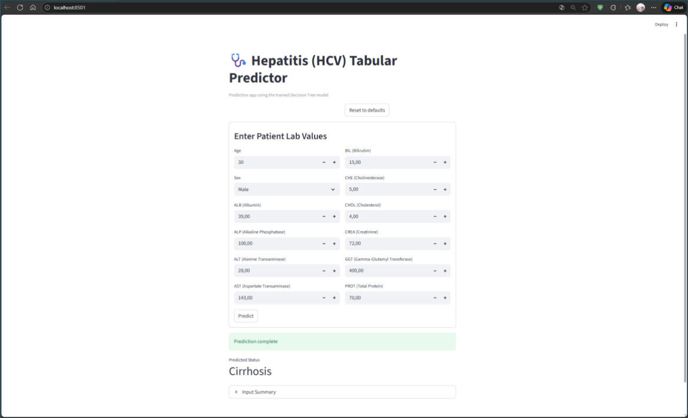  
*Gambar 11.3.16 Halaman Input dan Output*

---

### 11.5 TUGAS & ANALISIS
Gunakan dataset proyek kelompok Anda untuk melakukan pelatihan model Machine Learning. Setelah model terbaik didapatkan, bangun aplikasi dashboard interaktif menggunakan framework Streamlit untuk menerima input data pengguna dan menyajikan visualisasi hasil prediksi. Susun laporan praktikum lengkap sesuai format pedoman penulisan.

---

### 11.6 REFERENSI
- Dokumentasi Resmi Streamlit: https://docs.streamlit.io/
- Dokumentasi Resmi Python: https://www.python.org/doc/
- Dokumentasi Pandas & NumPy: https://pandas.pydata.org/ | https://numpy.org/
- Han, J., Pei, J., & Tong, H. (2022). *Data Mining: Concepts and Techniques* (4th ed.). Morgan Kaufmann/Elsevier.
