# Modul Praktikum Penambangan Data – Teknologi Rekayasa Perangkat Lunak – 2025
## PERTEMUAN VI: CLUSTERING DAN ASSOCIATION RULE

### 6.1 TUJUAN PEMBELAJARAN
A. Mahasiswa memahami konsep dasar dan paradigma *Unsupervised Learning* serta perbedaannya dengan *Supervised Learning*.  
B. Mahasiswa mampu memahami prinsip kerja, kelebihan, dan kelemahan algoritma klasterisasi (*clustering*): K-Means, K-Medoids (*Partitioning Around Medoids* / PAM), dan DBSCAN (*Density-Based Spatial Clustering of Applications with Noise*).  
C. Mahasiswa dapat mengevaluasi kualitas klaster menggunakan metrik evaluasi internal seperti *Inertia* (*Within-Cluster Sum of Squares* / WCSS) dan *Silhouette Score*, serta menentukan jumlah klaster optimal ($K$) menggunakan *Elbow Method* dan algoritma deteksi siku (*kneed*).  
D. Mahasiswa dapat menerapkan visualisasi hasil klasterisasi dalam dimensi dua (Matplotlib, Seaborn) dan dimensi tiga interaktif (Plotly Express).  
E. Mahasiswa mampu melakukan analisis profil klaster (*cluster profiling*) dan interpretasi bisnis atas segmen nasabah yang terbentuk.  
F. Mahasiswa memahami konsep dasar *Association Rule Mining*, metrik evaluasi (*Support, Confidence, Lift*), prinsip Apriori (*anti-monotonicity of support*), serta mekanisme pemangkasan kandidat itemset (*lattice pruning*).  

---

### 6.2 DASAR TEORI

#### 1. Unsupervised Learning
*Unsupervised Learning* merupakan paradigma pembelajaran mesin di mana algoritma mengeksplorasi dan memodelkan struktur data tanpa memerlukan anotasi atau label target dari manusia (*unlabeled data*). Sistem secara otomatis mengidentifikasi keteraturan, pola tersembunyi, atau distribusi kepadatan yang melekat pada kumpulan variabel input.

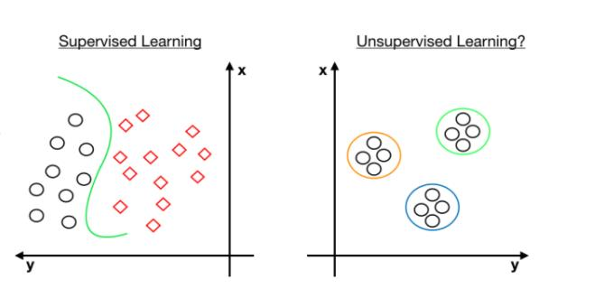  
*Gambar 6.2.1 Perbandingan Supervised vs Unsupervised Learning*

Perbedaan mendasar antara *Supervised* dan *Unsupervised Learning* meliputi:
1. **Supervised Learning:** Model mempelajari hubungan matematis antara pasangan fitur input ($X$) dan label target yang telah diketahui ($y$). Tujuannya adalah membangun fungsi pemetaan $f(X) \approx y$ untuk memprediksi label data baru (misalnya klasifikasi dan regresi).
2. **Unsupervised Learning:** Model hanya menerima variabel fitur input ($X$) tanpa adanya informasi target ($y$). Tujuannya adalah menemukan kelompok alami (*clustering*), pola asosiasi (*association rules*), atau reduksi dimensionalitas.

Di industri modern, *unsupervised learning* memegang peran sentral dalam berbagai domain aplikasi:
- **Customer Segmentation:** Mengelompokkan jutaan nasabah atau pengguna berdasarkan kemiripan kebiasaan transaksi, saldo, dan daya beli untuk merancang program pemasaran dan retensi yang tepat sasaran.
- **Anomaly Detection:** Mendeteksi transaksi penipuan (*fraud detection*), intrusi jaringan komputer, atau kerusakan mesin industri dengan menemukan titik-titik yang menyimpang jauh dari populasi normal.
- **Recommender Systems:** Menemukan kelompok pengguna dengan profil preferensi yang serupa (*collaborative filtering*) guna menyajikan rekomendasi produk, musik, atau konten artikel yang relevan.

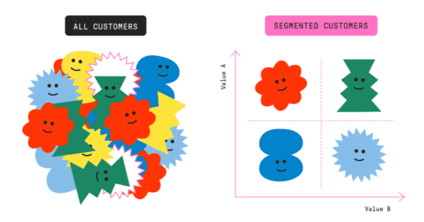  
*Gambar 6.2.2 Aplikasi Segmentasi Pelanggan Menggunakan Unsupervised Learning*

---

#### 2. Clustering (Klasterisasi)
Klasterisasi merupakan teknik mempartisi sekumpulan objek data ke dalam sejumlah subset atau kelompok (*cluster*). Prinsip pokok analisis klaster dirumuskan dalam dua sasaran:
1. **Intra-cluster similarity tinggi:** Objek-objek di dalam kelompok yang sama memiliki tingkat kesamaan karakteristik yang sangat dekat (*compact*).
2. **Inter-cluster dissimilarity tinggi:** Objek-objek yang berada di kelompok berbeda memiliki tingkat perbedaan yang signifikan (*well-separated*).

Metode klasterisasi secara garis besar terbagi menjadi:
- **Partitional Clustering:** Membagi data secara langsung ke dalam $K$ partisi disjoint tanpa struktur hierarkis (contoh: K-Means, K-Medoids).
- **Density-Based Clustering:** Membentuk klaster berdasarkan wilayah dengan kerapatan titik data tinggi yang dipisahkan oleh wilayah berkerapatan rendah (contoh: DBSCAN).
- **Hierarchical Clustering:** Membentuk struktur pohon klaster (*dendrogram*) baik secara aglomeratif (*bottom-up*) maupun divisif (*top-down*).

---

#### 3. Algoritma K-Means
Algoritma K-Means adalah algoritma klasterisasi partisional berbasis jarak yang paling populer. Algoritma ini membagi $n$ objek observasi ke dalam $K$ klaster, di mana setiap objek ditempatkan ke dalam klaster dengan pusat rata-rata (*centroid*) terdekat.

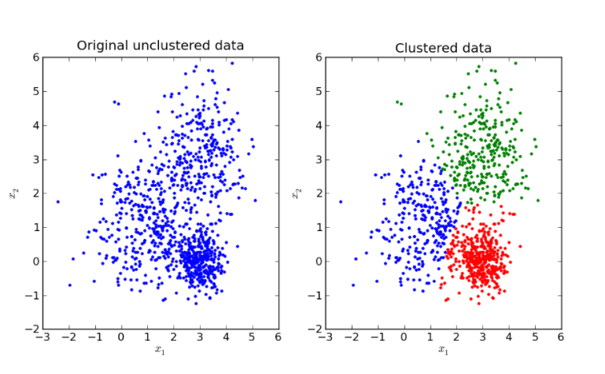  
*Gambar 6.2.3 Konsep Partisi Ruang Fitur pada K-Means Clustering*

##### Prinsip Kerja Algoritma K-Means:
1. **Inisialisasi Centroid:** Menentukan nilai $K$ (jumlah klaster yang diinginkan), kemudian memilih $K$ titik secara acak di dalam ruang fitur sebagai koordinat pusat massa (*centroid* / mean) awal.
2. **Penetapan Titik ke Klaster (Assignment Step):** Menghitung jarak antara setiap data point $x_i$ ke seluruh centroid $\mu_j$ menggunakan metrik jarak Euclidean:
   $$d(x_i, \mu_j) = \sqrt{\sum_{f=1}^{d} (x_{i,f} - \mu_{j,f})^2}$$
   Setiap data point dialokasikan ke klaster yang memiliki centroid terdekat:
   $$C_j = \{x_i : ||x_i - \mu_j||^2 \le ||x_i - \mu_{j'}||^2, \quad \forall j' \in \{1, \dots, K\}\}$$
3. **Pembaruan Posisi Centroid (Update Step):** Menghitung ulang koordinat centroid $\mu_j$ sebagai nilai rata-rata (*mean vector*) dari seluruh titik yang telah dialokasikan ke dalam klaster $C_j$:
   $$\mu_j = \frac{1}{|C_j|} \sum_{x \in C_j} x$$
4. **Iterasi dan Konvergensi:** Mengulangi langkah 2 dan 3 secara siklis hingga posisi centroid tidak lagi berpindah secara signifikan, atau keanggotaan klaster tidak lagi mengalami perubahan (*convergence*).

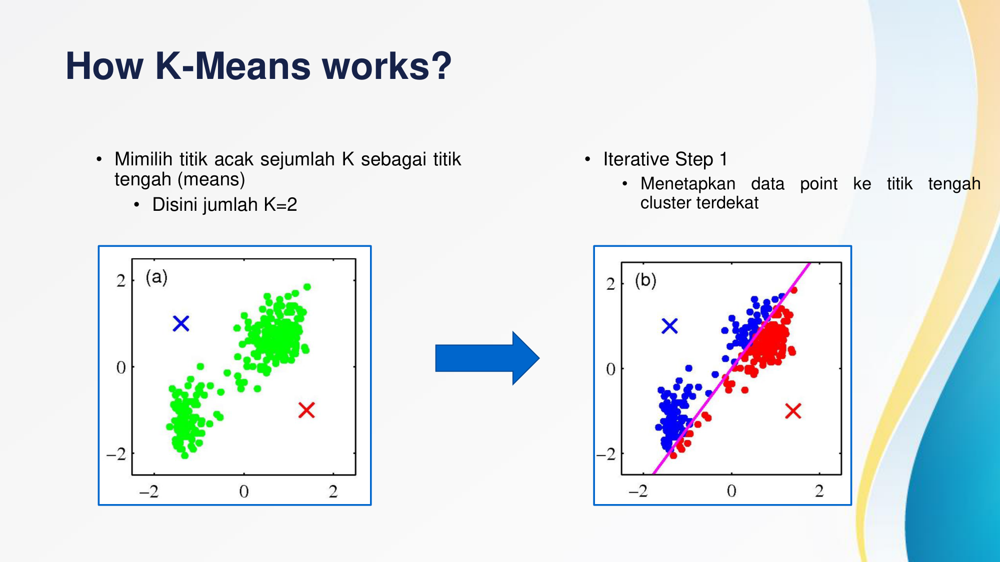  
*Gambar 6.2.4 K-Means Tahap 1: Pemilihan Titik Centroid Awal dan Penetapan Titik Terdekat*

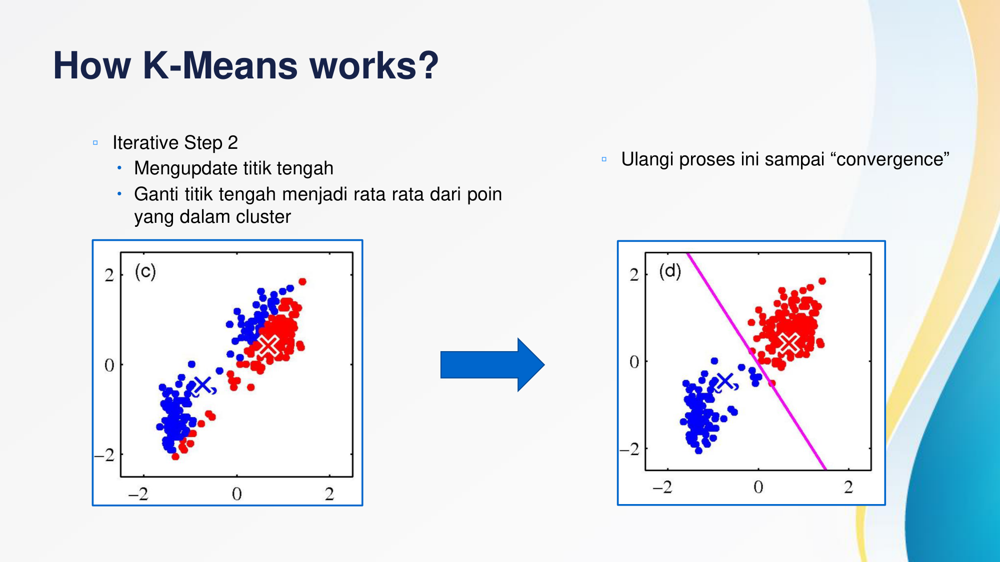  
*Gambar 6.2.5 K-Means Tahap 2: Pembaruan Centroid Mengikuti Rata-Rata Anggota Klaster*

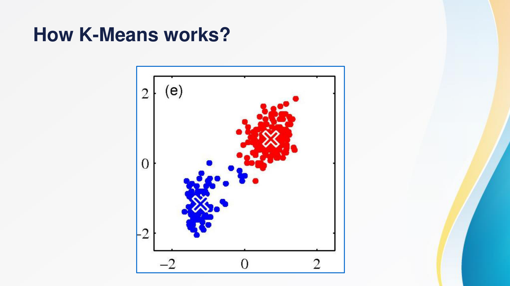  
*Gambar 6.2.6 Konvergensi K-Means: Kondisi Akhir Partisi Klaster yang Stabil*

##### Kelebihan K-Means:
- Algoritma mudah dipahami dan diimplementasikan secara komputasional.
- Efisiensi waktu komputasi yang linier terhadap jumlah data observasi, yaitu berorde $O(t \cdot K \cdot n \cdot d)$ di mana $t$ adalah jumlah iterasi, $K$ jumlah klaster, $n$ jumlah sampel, dan $d$ jumlah dimensi fitur.
- Sangat efektif untuk menangani dataset berukuran besar (*large-scale dataset*).

##### Kelemahan dan Masalah Outlier pada K-Means:
- Pengguna harus menentukan nilai $K$ secara manual di awal sebelum proses klasterisasi dimulai.
- Hasil akhir konvergensi sensitif terhadap pemilihan lokasi centroid awal (*local optima problem*).
- K-Means mengasumsikan bahwa seluruh klaster memiliki ukuran yang setara dan berbentuk sferis/lingkaran cembung (*spherical clusters*), sehingga gagal pada struktur data yang bergelombang atau arbitrer.
- **Sangat sensitif terhadap data pencilan (*outliers*):** Karena centroid dihitung berdasarkan rata-rata aritmetika (*mean*), keberadaan satu titik dengan nilai ekstrem akan menarik centroid menjauh dari pusat konsentrasi data sebenarnya, merusak batas partisi klaster.

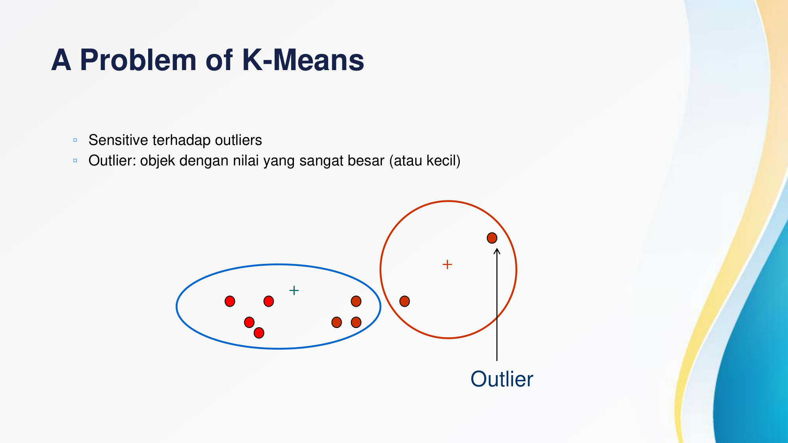  
*Gambar 6.2.7 Kerentanan K-Means terhadap Outlier yang Menggeser Centroid*

---

#### 4. Evaluasi Kualitas Klaster dan Penentuan Nilai K

Karena *unsupervised learning* tidak memiliki label acuan (*ground truth*), evaluasi model klasterisasi dilakukan menggunakan kriteria internal:

##### A. Inertia (Within-Cluster Sum of Squares / WCSS)
Inertia mengukur tingkat kerapatan (*compactness*) data di dalam klasternya masing-masing. Nilai ini dihitung sebagai jumlah total kuadrat jarak Euclidean antara setiap titik data terhadap centroid klaster terdekatnya:
$$Inertia = \sum_{j=1}^{K} \sum_{x_i \in C_j} ||x_i - \mu_j||^2$$
- Semakin kecil nilai inertia, semakin padat dan rapat sebaran titik data di sekitar centroidnya.
- Nilai inertia akan selalu menurun seiring bertambahnya nilai $K$. Ketika $K = n$, inertia bernilai 0. Oleh karena itu, penurunan inertia harus dianalisis menggunakan *Elbow Method*.

##### B. Silhouette Score
*Silhouette Score* mengukur seberapa baik suatu titik data diposisikan di dalam klasternya sendiri dibandingkan dengan klaster terdekat lainnya (*separation quality*). Untuk setiap sampel observasi $i$:
$$s(i) = \frac{b(i) - a(i)}{\max(a(i), b(i))}$$
Di mana:
- $a(i)$ adalah rata-rata jarak antara titik $i$ ke semua titik lain yang berada di dalam klaster yang sama (*mean intra-cluster distance*).
- $b(i)$ adalah rata-rata jarak antara titik $i$ ke seluruh titik pada klaster lain yang paling dekat dengannya (*mean nearest-cluster distance*).

Nilai *Silhouette Score* berada dalam rentang $[-1, 1]$:
- **Mendekati +1:** Titik data terpisah sangat jelas dari klaster tetangga dan sangat dekat dengan anggota klasternya sendiri (*klaster berkualitas optimal*).
- **Mendekati 0:** Titik data berada tepat di perbatasan batas keputusan (*decision boundary*) antar dua klaster (*terjadi overlap/tumpang tindih*).
- **Bernilai Negatif (mendekati -1):** Titik data memiliki probabilitas tinggi ditempatkan pada klaster yang salah karena lebih dekat ke klaster lain.

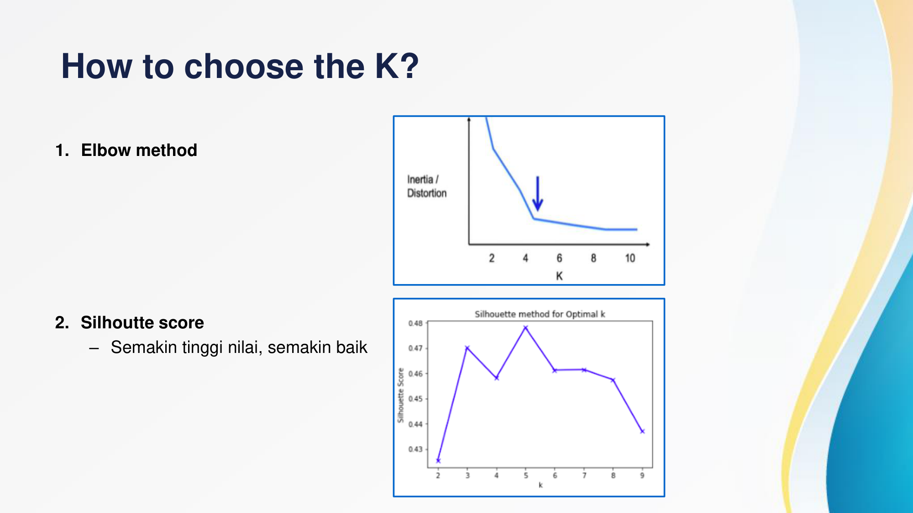  
*Gambar 6.2.8 Penentuan Nilai K Optimal Menggunakan Elbow Method dan Silhouette Score*

##### C. Metode Pemilihan K Optimal:
1. **Elbow Method:** Memplot grafik nilai Inertia terhadap variasi nilai $K$ (misal $K = 1 \dots 10$). Nilai $K$ optimal dipilih pada titik siku (*elbow/knee point*), yaitu titik di mana penambahan nilai $K$ selanjutnya tidak lagi memberikan penurunan inertia yang tajam.
2. **Deteksi Otomatis Menggunakan KneeLocator (`kneed`):** Library `kneed` mengimplementasikan algoritma pendeteksi kelengkungan kurva matematis untuk menentukan koordinat siku kurva secara objektif tanpa bias interpretasi visual manusia.
3. **Silhouette Analysis:** Memilih nilai $K$ yang menghasilkan nilai rata-rata koefisien siluet (*mean silhouette score*) tertinggi pada rentang pengujian.

---

#### 5. Algoritma K-Medoids (Partitioning Around Medoids / PAM)
Algoritma K-Medoids diperkenalkan oleh Leonard Kaufman dan Peter J. Rousseeuw (1990) sebagai penyempurnaan atas kelemahan K-Means terhadap *outlier*. K-Medoids mempartisi data ke dalam $K$ klaster dengan memilih objek data riil aktual dari dataset sebagai pusat representasi klaster (*medoid*), bukan rata-rata imajiner (*mean*).

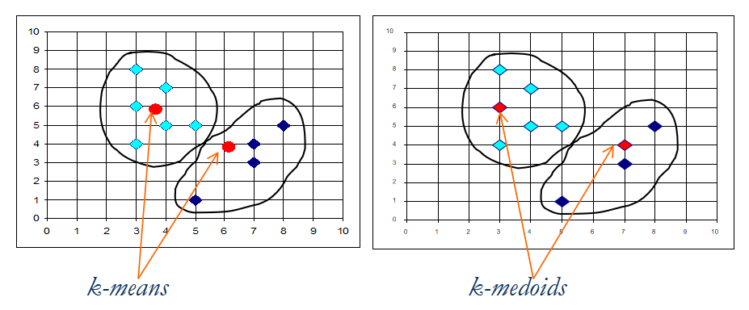  
*Gambar 6.2.9 Perbedaan Titik Pusat Klaster: Mean Aritmetika (K-Means) vs Titik Riil Medoid (K-Medoids)*

##### Perbedaan Utama K-Means vs K-Medoids:
| Parameter | K-Means | K-Medoids (PAM) |
| :--- | :--- | :--- |
| **Pusat Klaster** | Titik rata-rata (*mean vector*), seringkali merupakan koordinat imajiner | Objek data riil (*medoid*) yang benar-benar ada di dalam dataset |
| **Fungsi Objektif** | Meminimalkan *Sum of Squared Errors* (jarak kuadrat Euclidean) | Meminimalkan *Sum of Absolute Dissimilarities* (jarak absolut Manhattan/Euclidean) |
| **Ketahanan Outlier** | Rentan terdistorsi oleh data ekstrem / pencilan (*sensitive*) | Sangat tahan terhadap gangguan noise dan nilai ekstrem (*robust*) |
| **Kompleksitas Komputasi** | Cepat, berorde linier $O(t \cdot K \cdot n \cdot d)$ | Lebih berat, berorde kuadratik $O(t \cdot K \cdot (n - K)^2)$ |

##### Prinsip Kerja Algoritma Partitioning Around Medoids (PAM):
1. **Inisialisasi:** Memilih secara acak $K$ objek dari seluruh dataset sebagai himpunan medoid awal $M = \{m_1, m_2, \dots, m_K\}$.
2. **Alokasi Titik:** Mengalokasikan setiap objek non-medoid ke medoid terdekatnya berdasarkan metrik dissimilaritas absolut.
3. **Evaluasi Pertukaran Medoid (Swapping):** Untuk setiap pasangan medoid $m_i$ dan objek non-medoid $o_h$:
   - Simulasikan pertukaran posisi medoid: gantikan $m_i$ dengan $o_h$.
   - Hitung total kriteria galat absolut (*absolute error criterion*):
     $$E = \sum_{i=1}^{K} \sum_{p \in C_i} |p - m_i|$$
   - Hitung nilai perubahan biaya swapping ($S$):
     $$S = E_{\text{baru}} - E_{\text{lama}}$$
4. **Keputusan Swapping:** Jika $S < 0$, pertukaran medoid menghasilkan galat yang lebih kecil sehingga posisi medoid diperbarui secara permanen dengan $o_h$. Jika $S \ge 0$, pertukaran dibatalkan.
5. **Konvergensi:** Mengulangi langkah 2 hingga 4 sampai tidak ada lagi pertukaran medoid yang mampu menurunkan nilai total kriteria galat absolut $E$.

##### Contoh Simulasi Numerik K-Medoids (10 Titik Data):
Diberikan 10 objek dua dimensi $(A_1, A_2)$:  
$O_1(2,6)$, $O_2(3,4)$, $O_3(3,8)$, $O_4(4,7)$, $O_5(6,2)$, $O_6(6,4)$, $O_7(7,3)$, $O_8(7,4)$, $O_9(8,5)$, $O_{10}(7,6)$.

Misalkan dipilih $K = 2$ dengan medoid awal $O_2(3,4)$ dan $O_8(7,4)$:
- **Klaster 1 (Pusat $O_2$):** beranggotakan $O_1, O_3, O_4$.
  $$|O_1 - O_2| + |O_3 - O_2| + |O_4 - O_2| = 3 + 4 + 4 = 11$$
- **Klaster 2 (Pusat $O_8$):** beranggotakan $O_5, O_6, O_7, O_9, O_{10}$.
  $$|O_5 - O_8| + |O_6 - O_8| + |O_7 - O_8| + |O_9 - O_8| + |O_{10} - O_8| = 3 + 1 + 1 + 2 + 2 = 9$$
- **Total Galat Absolut Awal:**
  $$E_{\text{lama}} = 11 + 9 = 20$$

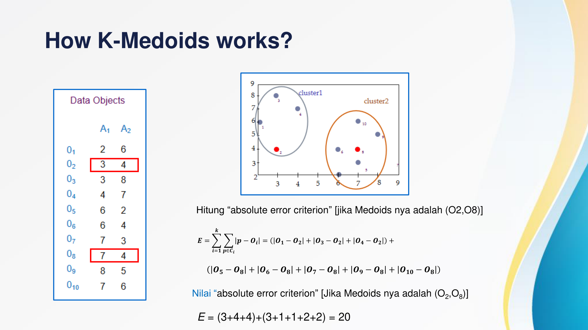  
*Gambar 6.2.10 Perhitungan Nilai Kriteria Galat Absolut E pada Pasangan Medoid (O2, O8)*

Selanjutnya, dievaluasi sebuah pertukaran kandidat: medoid $O_8$ digantikan dengan objek non-medoid $O_7(7,3)$, sehingga pasangan medoid baru adalah $(O_2, O_7)$:
- Klaster 1 (Pusat $O_2$): total jarak tetap $11$.
- Klaster 2 (Pusat $O_7$): total jarak $= 2 + 2 + 1 + 3 + 3 = 11$.
- Total Galat Absolut Baru:
  $$E_{\text{baru}} = 11 + 11 = 22$$
- Evaluasi Fungsi Biaya (*Cost Function*):
  $$S = E_{\text{baru}} - E_{\text{lama}} = 22 - 20 = +2$$

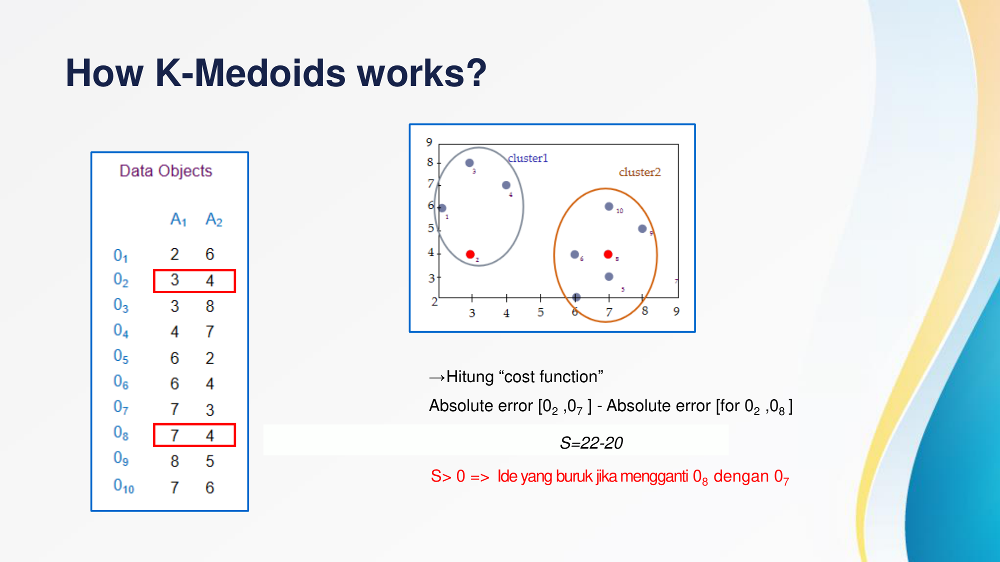  
*Gambar 6.2.11 Evaluasi Fungsi Biaya Swapping: S > 0 Mengindikasikan Pertukaran Harus Ditolak*

Karena nilai $S = +2 > 0$, penggantian medoid $O_8$ dengan $O_7$ justru memperbesar total error sistem. Oleh karena itu, pertukaran tersebut **ditolak**, dan $O_8$ dipertahankan sebagai medoid.

---

#### 6. Algoritma DBSCAN (Density-Based Spatial Clustering of Applications with Noise)
Algoritma DBSCAN diusulkan oleh Martin Ester, Hans-Peter Kriegel, Jörg Sander, dan Xiaowei Xu pada tahun 1996. Algoritma ini dirancang khusus untuk menemukan klaster dengan bentuk arbitrer (*non-spherical arbitrary shapes*) dan mampu memisahkan titik derau (*noise/outliers*) secara otomatis.

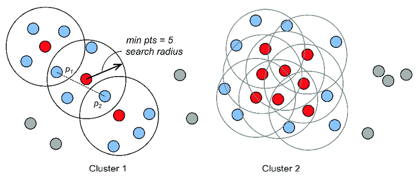  
*Gambar 6.2.12 Konsep Klasterisasi Berbasis Kerapatan (Density-Based Clustering)*

##### Mengapa DBSCAN Dibutuhkan?
Algoritma berbasis jarak seperti K-Means mengasumsikan klaster berbentuk cembung sferis. Ketika berhadapan dengan data yang membentuk cincin konsentris berulang (*concentric circles*) atau struktur bulan sabit (*two moons*), K-Means memotong lingkaran menjadi irisan-irisan baji yang membagi kelompok secara keliru. Sebaliknya, DBSCAN melacak konektivitas kerapatan titik, sehingga mampu membedakan cincin dalam, cincin tengah, dan cincin luar secara sempurna, sekaligus mengisolasi titik pencilan sebagai noise.

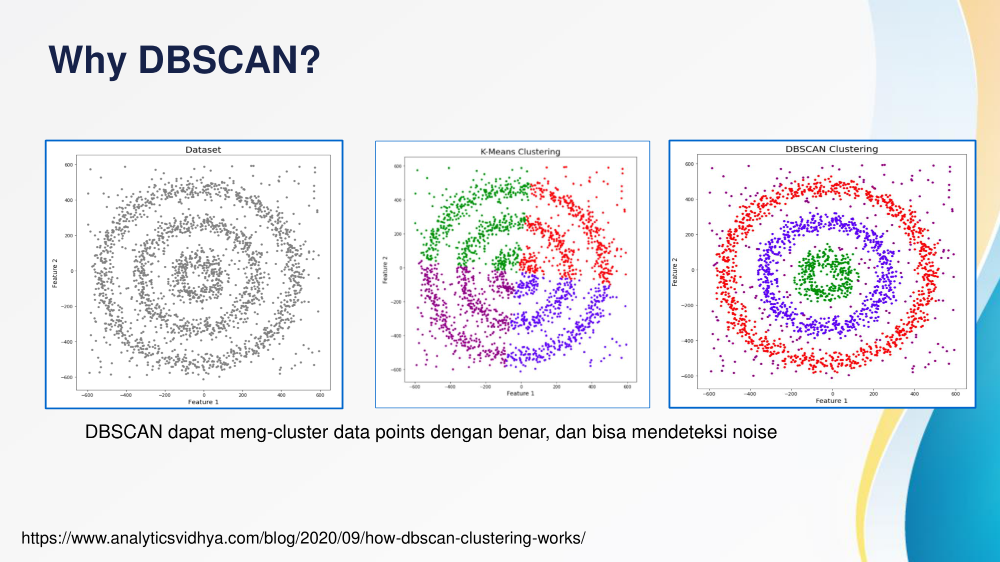  
*Gambar 6.2.13 Perbandingan Performa: Kegagalan K-Means vs Keberhasilan DBSCAN Memisahkan Cincin Konsentris dan Noise*

##### Parameter Kunci DBSCAN:
1. **$\epsilon$ (*Epsilon*):** Radius jarak maksimum di sekitar suatu titik observasi yang dijadikan batas lingkungan pencarian (*neighborhood*).
2. **$MinPts$ (*Minimum Points*):** Jumlah minimum titik tetangga yang harus berada di dalam radius $\epsilon$ agar sebuah titik memenuhi kualifikasi sebagai titik inti (*core point*).

##### Definisi Konseptual DBSCAN:
- **$\epsilon$-Neighborhood:** Himpunan titik data yang jaraknya ke titik $p$ tidak melebihi $\epsilon$:
  $$N_\epsilon(p) = \{q \in D \mid \text{dist}(p, q) \le \epsilon\}$$
- **Core Object (Titik Inti):** Suatu titik $p$ diklasifikasikan sebagai *core object* jika jumlah titik di dalam lingkungan radius $\epsilon$-nya memenuhi batas minimum:
  $$|N_\epsilon(p)| \ge MinPts$$
- **Directly Density-Reachable:** Titik $p$ disebut *directly density-reachable* dari titik $q$ jika $q$ adalah *core object* dan $p$ berada di dalam lingkungan radius $\epsilon$ dari $q$ ($p \in N_\epsilon(q)$).

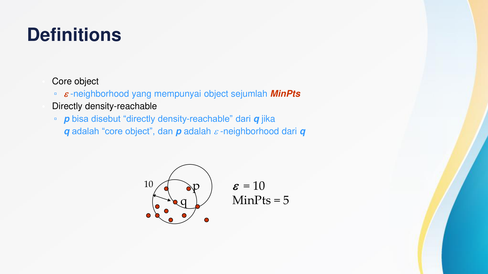  
*Gambar 6.2.14 Ilustrasi Core Object q dengan Radius Epsilon = 10 dan MinPts = 5*

- **Density-Reachable:** Suatu titik $p$ dikatakan *density-reachable* dari titik $q$ jika terdapat rantai titik perantara $p_1, p_2, \dots, p_n$ dengan $p_1 = q$ dan $p_n = p$ di mana setiap $p_{i+1}$ bersifat *directly density-reachable* dari $p_i$.
- **Density-Connected:** Titik $p$ dan titik $q$ dikatakan *density-connected* jika terdapat sebuah titik inti $o$ sedemikian rupa sehingga $p$ dan $q$ sama-sama bersifat *density-reachable* dari $o$.

##### Tiga Tipe Titik pada DBSCAN:
1. **Core Point (Merah):** Titik yang memiliki minimal $MinPts$ tetangga di dalam radius $\epsilon$. Titik ini menjadi motor pembentuk klaster.
2. **Border Point (Biru):** Titik yang berada di dalam radius $\epsilon$ dari suatu *core point*, namun jumlah tetangganya sendiri kurang dari $MinPts$. Titik ini berada di pinggiran batas luar klaster.
3. **Noise Point (Abu-abu):** Titik yang bukan merupakan *core point* dan tidak berada di dalam jangkauan $\epsilon$ dari *core point* mana pun. Titik ini diklasifikasikan sebagai pencilan (*outlier*).

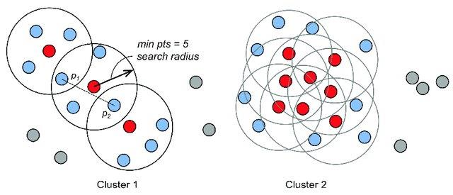  
*Gambar 6.2.15 Tiga Kategori Titik Data: Core Point (Merah), Border Point (Biru), dan Noise Point (Abu-abu)*

##### Pedoman Penentuan Parameter $MinPts$ dan $\epsilon$:
1. **Menentukan $MinPts$:**
   - Gunakan pengetahuan domain (*domain knowledge*) karakteristik data.
   - Semakin besar volume dataset dan semakin tinggi tingkat gangguan noise, semakin besar nilai $MinPts$ yang dipilih.
   - Aturan praktis (*rule of thumb*): $MinPts \ge D + 1$, di mana $D$ adalah jumlah dimensi fitur data.
   - Untuk data 2 dimensi ($D=2$), gunakan $MinPts = 4$ (Ester et al., 1996).
   - Untuk data dengan dimensi lebih dari dua ($D > 2$), gunakan $MinPts = 2 \times D$ (Sander et al., 1998).
2. **Menentukan $\epsilon$ Menggunakan Grafik Jarak K-Tetangga (*Sorted K-distance Graph*):**
   - Tetapkan nilai $k = MinPts$.
   - Untuk setiap titik data, hitung jarak Euclidean ke tetangga terdekat ke-$k$.
   - Urutkan seluruh nilai jarak tersebut secara menaik (*ascending*) dan visualisasikan grafiknya.
   - Nilai $\epsilon$ optimal diambil pada titik belokan siku (*elbow point / knee*) di mana kurva melonjak tajam. Titik sebelum belokan menunjukkan densitas klaster normal, sedangkan titik setelah belokan mengindikasikan transisi menuju noise.

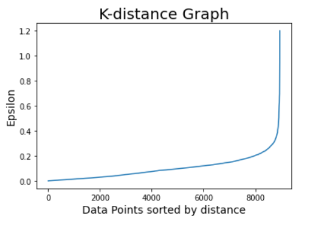  
*Gambar 6.2.16 Grafik Sorted K-distance untuk Menentukan Ambang Batas Epsilon Optimal*

---

#### 7. Association Rule Mining (Aturan Asosiasi)
*Association Rule Mining* adalah teknik *data mining* untuk menemukan pola asosiasi, korelasi, atau keterkaitan tersembunyi antar-item dalam basis data transaksi besar (*Market Basket Analysis*).

Aturan asosiasi dinyatakan dalam bentuk implikasi logis:
$$X \rightarrow Y$$
Di mana $X$ disebut sebagai *antecedent* (kondisi awal) dan $Y$ disebut sebagai *consequent* (hasil asosiasi), dengan syarat $X \cap Y = \emptyset$.  
> **Prinsip Utama:** Pernyataan implikasi $X \rightarrow Y$ mencerminkan kemunculan bersamaan (*co-occurrence*), **bukan hubungan sebab-akibat kausalitas (*causality*)**.

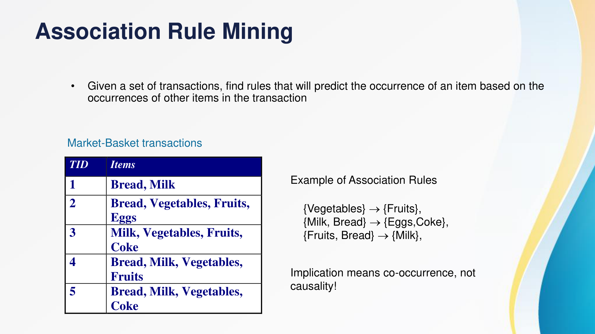  
*Gambar 6.2.17 Contoh Basis Data Transaksi Keranjang Belanja (Market-Basket Transactions)*

##### Terminologi Pokok:
- **Itemset:** Kumpulan dari satu atau lebih item (misal: $\{\text{Bread}, \text{Milk}\}$).
- **$k$-Itemset:** Himpunan item yang terdiri dari tepat $k$ item berbeda.
- **Support Count ($\sigma$):** Frekuensi kemunculan absolut suatu itemset dalam seluruh database transaksi:
  $$\sigma(X) = |\{t \in T \mid X \subseteq t\}|$$
- **Frequent Itemset:** Itemset yang memiliki nilai *support* sama dengan atau lebih besar dari batas minimum yang ditentukan (*minsup threshold*).

##### Tiga Metrik Evaluasi Aturan Asosiasi:
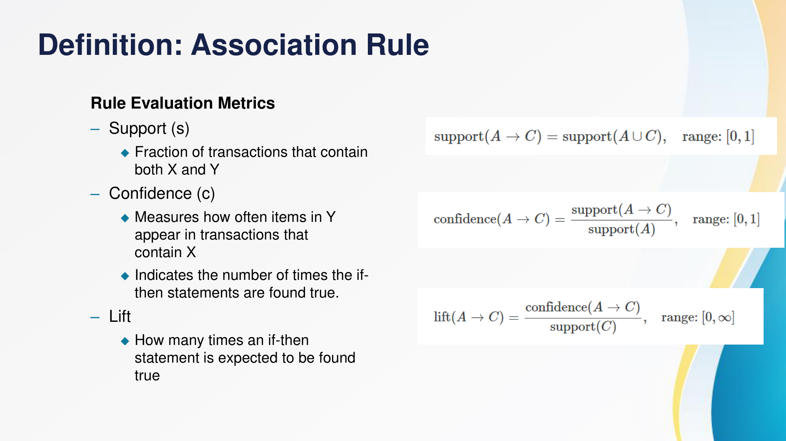  
*Gambar 6.2.18 Tiga Metrik Kualitas Aturan Asosiasi: Support, Confidence, dan Lift*

1. **Support ($s$):** Proporsi atau fraksi transaksi dalam database yang memuat kombinasi item $X$ dan $Y$ secara bersamaan:
   $$s(X \rightarrow Y) = \frac{\sigma(X \cup Y)}{|T|}$$
2. **Confidence ($c$):** Tingkat kepastian atau probabilitas kondisional kemunculan item $Y$ pada transaksi yang telah memuat item $X$:
   $$c(X \rightarrow Y) = \frac{\sigma(X \cup Y)}{\sigma(X)}$$
3. **Lift:** Rasio kekuatan aturan dibandingkan jika kejadian $X$ dan $Y$ diasumsikan independen secara statistik:
   $$Lift(X \rightarrow Y) = \frac{c(X \rightarrow Y)}{s(Y)} = \frac{\sigma(X \cup Y) / |T|}{(\sigma(X) / |T|) \times (\sigma(Y) / |T|)}$$
   - **$Lift = 1$:** Kejadian $X$ dan $Y$ independen (tidak memiliki pengaruh asosiatif).
   - **$Lift > 1$:** Asosiasi positif kuat (kehadiran item $X$ meningkatkan kemungkinan pembelian item $Y$).
   - **$Lift < 1$:** Asosiasi negatif / saling menggantikan (*substitutive relationship*).

##### Contoh Perhitungan Nyata Aturan Asosiasi:
Diberikan basis data transaksi dengan $|T| = 5$ transaksi:
- TID 1: `{Bread, Milk}`
- TID 2: `{Bread, Vegetables, Fruits, Eggs}`
- TID 3: `{Milk, Vegetables, Fruits, Coke}`
- TID 4: `{Bread, Milk, Vegetables, Fruits}`
- TID 5: `{Bread, Milk, Vegetables, Coke}`

Evaluasi kualitas aturan asosiasi:  
$$\{\text{Milk}, \text{Vegetables}\} \rightarrow \{\text{Fruits}\}$$

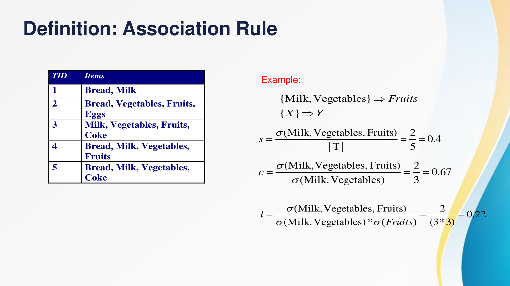  
*Gambar 6.2.19 Langkah Perhitungan Numerik Metrik Support, Confidence, dan Lift*

- **Perhitungan Support:**
  Kombinasi item $\{\text{Milk}, \text{Vegetables}, \text{Fruits}\}$ muncul pada TID 3 dan TID 4 ($\sigma = 2$).
  $$s = \frac{2}{5} = 0.40 \quad (40\%)$$
- **Perhitungan Confidence:**
  Itemset $\{\text{Milk}, \text{Vegetables}\}$ muncul pada TID 3, TID 4, dan TID 5 ($\sigma = 3$).
  $$c = \frac{\sigma(\text{Milk, Vegetables, Fruits})}{\sigma(\text{Milk, Vegetables})} = \frac{2}{3} \approx 0.67 \quad (66.7\%)$$
- **Perhitungan Lift:**
  Item $\{\text{Fruits}\}$ muncul pada TID 2, TID 3, dan TID 4 ($\sigma = 3$), sehingga $s(\text{Fruits}) = 3/5 = 0.60$.
  $$Lift = \frac{s(\text{Milk, Vegetables, Fruits})}{s(\text{Milk, Vegetables}) \times s(\text{Fruits})} = \frac{0.40}{0.60 \times 0.60} = \frac{0.40}{0.36} \approx 1.11$$
  Karena $Lift = 1.11 > 1$, aturan ini menunjukkan adanya keterkaitan asosiasi positif yang valid.

---

#### 8. Algoritma Apriori
Tantangan utama dalam *Association Rule Mining* adalah ledakan kombinatorial jumlah kandidat itemset. Untuk alfabet yang terdiri dari $d$ item berbeda, terdapat $2^d - 1$ kemungkinan itemset yang harus dievaluasi.

##### Prinsip Apriori (Anti-monotonicity of Support):
Rakesh Agrawal dan Ramakrishnan Srikant (1994) merumuskan sifat dasar penurunan monoton (*anti-monotonicity*):
> *"Jika suatu itemset bersifat sering (frequent), maka seluruh himpunan bagiannya (subsets) pasti sering. Konsekuensinya, jika suatu itemset tidak sering (infrequent), maka seluruh himpunan bagian yang memuatnya (supersets) dipastikan tidak sering dan tidak perlu dihitung."*

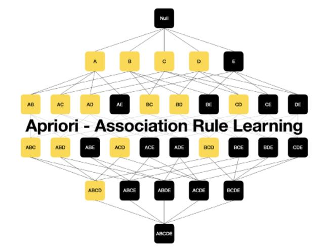  
*Gambar 6.2.20 Prinsip Apriori: Pemangkasan Ruang Pencarian Berdasarkan Sifat Anti-monoton*

##### Pemangkasan Kandidat Itemset pada Kisi (Lattice Pruning):
Sebagai ilustrasi, apabila itemset ukuran-2 $\{A, B\}$ terbukti tidak sering (*infrequent* / berada di bawah ambang batas $min\_sup$), maka seluruh superset berukuran lebih tinggi yang memuat pasangan tersebut—yaitu $\{A, B, C\}$, $\{A, B, D\}$, $\{A, B, E\}$, $\{A, B, C, D\}$, hingga $\{A, B, C, D, E\}$—langsung dipangkas (*pruned*) dari pencarian tanpa perlu memindai database kembali.

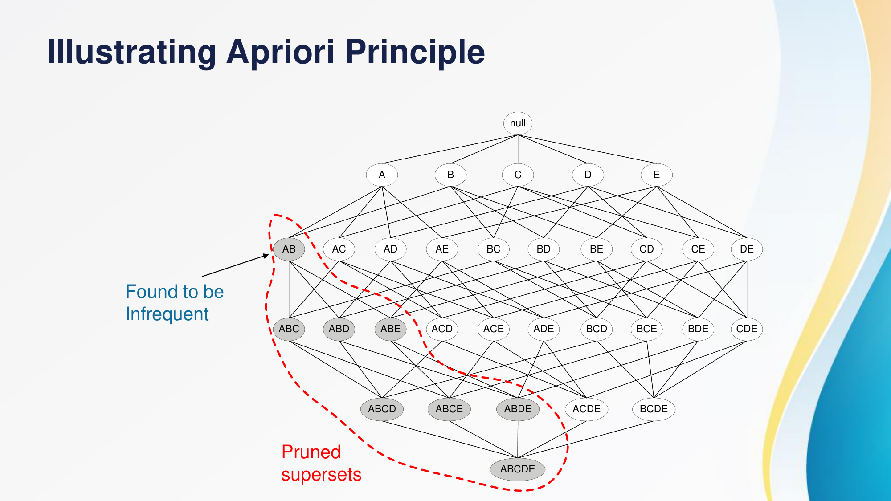  
*Gambar 6.2.21 Kisi Kombinasi Itemset dan Daerah Pemangkasan Supersets yang Tidak Sering*

##### Alur Kerja Algoritma Apriori:
1. Tetapkan $k = 1$. Pindai database transaksi untuk menghitung nilai support setiap item tunggal guna membentuk kandidat $C_1$, kemudian saring yang memenuhi $min\_sup$ untuk menghasilkan *frequent 1-itemset* ($L_1$).
2. Bangkitkan kandidat berukuran $(k+1)$ yaitu $C_{k+1}$ dari $L_k$ melalui operasi penggabungan (*join step*).
3. Pangkas (*prune step*) setiap kandidat dalam $C_{k+1}$ yang memuat subset berukuran $k$ yang tidak termasuk dalam $L_k$.
4. Pindai database kembali untuk menghitung nilai support dari kandidat yang lolos pemangkasan.
5. Saring kandidat tersebut untuk membentuk $L_{k+1}$.
6. Ulangi proses iteratif ini hingga tidak ada lagi *frequent itemset* baru yang dapat dibentuk.

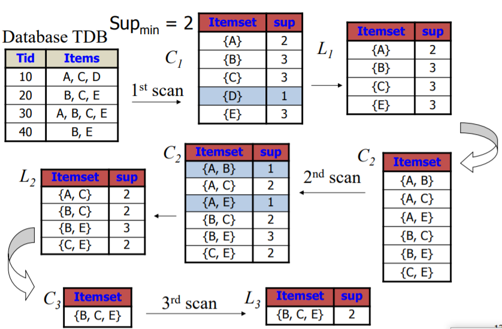  
*Gambar 6.2.22 Alur Iteratif Apriori: Pembangkitan Kandidat (Ck) dan Penyaringan Frequent Itemset (Lk)*

---

### 6.3 ALAT DAN BAHAN

**A. Perangkat Keras**  
1. Laptop / Komputer personal dengan kapasitas memori minimal 4 GB RAM.  
2. Koneksi internet stabil untuk instalasi modul dan pengunduhan dataset daring.  

**B. Perangkat Lunak**  
1. Sistem Operasi (Windows, macOS, atau Linux).  
2. Web Browser modern (Google Chrome, Mozilla Firefox, Microsoft Edge).  
3. Lingkungan pengembangan: Google Colaboratory atau Jupyter Notebook.  
4. Bahasa Pemrograman Python versi 3.8 ke atas.  
5. Pustaka Python utama:
   - `pandas` dan `numpy` (eksplorasi, manipulasi matriks, dan pembersihan data tabular).
   - `matplotlib.pyplot` dan `seaborn` (visualisasi kurva inertia, sebaran scatter plot, dan diagram batang).
   - `plotly.express` (visualisasi sebaran data interaktif tiga dimensi).
   - `scikit-learn` (`StandardScaler`, `KMeans`, `silhouette_score`).
   - `scikit-learn-extra` (`KMedoids` untuk klasterisasi berbasis medoids).
   - `kneed` (`KneeLocator` untuk pendeteksian titik siku kurva optimal secara matematis).

---

### 6.4 LANGKAH PERCOBAAN

#### 1. Persiapkan Lingkungan Kerja IDE
Mahasiswa memulai percobaan dengan membuka Google Colab atau Jupyter Notebook lokal. Colab memberikan keunggulan berupa ketersediaan pustaka *data science* standar dan dukungan komputasi awan yang terisolasi.

#### 2. Instalasi dan Impor Library
Menginstal pustaka tambahan `scikit-learn-extra` dan `kneed` jika belum tersedia di lingkungan, lalu mengimpor seluruh pustaka yang diperlukan:

```python
import numpy as np
import pandas as pd
import matplotlib.pyplot as plt
import seaborn as sns
import plotly.express as px

from sklearn.preprocessing import StandardScaler
from sklearn.cluster import KMeans
from sklearn.metrics import silhouette_samples, silhouette_score
```

  
*Gambar 6.4.1 Impor Pustaka Utama Python*

#### 3. Membaca dan Memuat Informasi Dataset
Dataset yang digunakan adalah *Credit Card Dataset for Clustering* (`CC GENERAL.csv`) yang mencatat perilaku sekitar 9.000 pemegang kartu kredit aktif selama periode 6 bulan terakhir.

1. Memuat dataset dari repositori daring dan memeriksa dimensi data serta lima baris pertama:

```python
df = pd.read_csv('https://raw.githubusercontent.com/ganjar87/data_science_practice/main/CC%20GENERAL.csv')
print("Dimensi dataset:", df.shape)
df.head()
```

  
*Gambar 6.4.2 Membaca Dataset Kartu Kredit (CC GENERAL.csv)*

2. Memeriksa tipe data, jumlah entri non-null, dan ringkasan statistik deskriptif:

```python
df.info()
df.describe().T
```

  
*Gambar 6.4.3 Memeriksa Tipe Data dan Struktur Fitur Dataset*

3. Memeriksa korelasi Pearson antar-fitur numerik untuk mengidentifikasi variabel yang memiliki multikolinearitas:

```python
df.corr(numeric_only=True)
```

  
*Gambar 6.4.4 Matriks Korelasi Antar-Variabel Numerik*

#### 4. Pembersihan Data (Data Cleaning)
1. Kolom `CUST_ID` merupakan identifikasi unik nasabah yang tidak memiliki kontribusi terhadap jarak geometris klaster, sehingga harus dihapus:

```python
df_new = df.drop(['CUST_ID'], axis=1)
df_new.head()
```

  
*Gambar 6.4.5 Menghapus Kolom Identitas CUST_ID*

2. Menghitung jumlah nilai hilang (*missing values*) pada setiap kolom:

```python
df_new.isnull().sum()
```

  
*Gambar 6.4.6 Identifikasi Nilai Hilang pada Kolom Dataset*

Berdasarkan pengecekan, terdapat 1 nilai hilang pada `CREDIT_LIMIT` dan 313 nilai hilang pada `MINIMUM_PAYMENTS`.

3. Melakukan imputasi nilai hilang menggunakan nilai median dari masing-masing fitur guna menghindari pergeseran distribusi akibat pencilan:

```python
df_new['MINIMUM_PAYMENTS'].fillna(df_new['MINIMUM_PAYMENTS'].median(), inplace=True)
df_new['CREDIT_LIMIT'].fillna(df_new['CREDIT_LIMIT'].median(), inplace=True)
```

  
*Gambar 6.4.7 Imputasi Nilai Hilang Menggunakan Median*

4. Memverifikasi bahwa tidak ada lagi nilai kosong yang tertinggal:

```python
df_new.isnull().sum()
```

  
*Gambar 6.4.8 Verifikasi Pasca-Imputasi Nilai Hilang*

#### 5. Standarisasi Skala Fitur Data
Algoritma klasterisasi sangat bergantung pada perhitungan jarak Euclidean. Oleh karena itu, seluruh fitur dinormalisasi menggunakan `StandardScaler` agar memiliki rata-rata $\mu = 0$ dan standar deviasi $\sigma = 1$:

```python
X = df_new.astype(float).values
scaler = StandardScaler().fit(X)
X_new = scaler.transform(X)
X_new
```

  
*Gambar 6.4.9 Standarisasi Matriks Fitur Menggunakan StandardScaler*

---

#### 6. Penentuan Jumlah Klaster Optimal (Elbow Method & Silhouette Score)

##### 1. Elbow Method pada K-Means
Menjalankan pemodelan K-Means untuk rentang nilai $K = 1$ hingga $10$, lalu menyimpan nilai *inertia* yang dihasilkan:

```python
inertia_list = []
for num_clusters in range(1, 11):
    kmeans_model = KMeans(n_clusters=num_clusters, random_state=42)
    kmeans_model.fit(X_new)
    inertia_list.append(kmeans_model.inertia_)
    print("For n_clusters = {}, inertia value is {})".format(num_clusters, kmeans_model.inertia_))
```

  
*Gambar 6.4.10 Pencatatan Nilai Inertia untuk Variasi Nilai K (1-10)*

Membuat plot grafik kurva inertia:

```python
plt.figure(figsize=(8, 6))
plt.plot(range(1, 11), inertia_list, marker='o', linewidth=2, markersize=8)
plt.xlabel("Number of Clusters", size=13)
plt.ylabel("Inertia Value", size=13)
plt.title("Inertia values vary depending on the number of clusters utilized.")
plt.show()
```

  
*Gambar 6.4.11 Kurva Penurunan Nilai Inertia K-Means*

Mendeteksi titik siku secara otomatis menggunakan algoritma `KneeLocator`:

```python
from kneed import KneeLocator
kneedle = KneeLocator(range(1, 11), inertia_list, S=1.0, curve='convex', direction='decreasing')
print("Optimal Knee Point:", round(kneedle.knee, 3))
print("Optimal Elbow Point:", round(kneedle.elbow, 3))
```

  
*Gambar 6.4.12 Deteksi Titik Siku Kurva K-Means (Ditemukan K = 4)*

Visualisasi konfirmasi titik siku kurva:

```python
plt.style.use('ggplot')
kneedle.plot_knee()
plt.show()
```

  
*Gambar 6.4.13 Plot Validasi Titik Siku Optimal K = 4*

##### 2. Elbow Method pada K-Medoids
Melakukan pengujian nilai $K = 1$ hingga $10$ menggunakan algoritma `KMedoids`:

```python
from sklearn_extra.cluster import KMedoids

inertia_list_kmed = []
for num_clusters in range(1, 11):
    kmedoids_model = KMedoids(n_clusters=num_clusters, random_state=42)
    kmedoids_model.fit(X_new)
    inertia_list_kmed.append(kmedoids_model.inertia_)
    print(f"The inertia of {num_clusters} clusters : {kmedoids_model.inertia_}")
```

  
*Gambar 6.4.14 Evaluasi Nilai Inertia pada K-Medoids*

Membuat plot kurva inertia K-Medoids:

```python
plt.plot(range(1, 11), inertia_list_kmed, marker='o', linewidth=2, markersize=8)
plt.xlabel("Number of Clusters", size=13)
plt.ylabel("Inertia Value", size=13)
plt.title("Inertia values vary depending on the number of clusters utilized.")
plt.show()
```

  
*Gambar 6.4.15 Kurva Penurunan Nilai Inertia K-Medoids*

Deteksi titik siku otomatis pada K-Medoids:

```python
kneedle_med = KneeLocator(range(1, 11), inertia_list_kmed, S=1.0, curve='convex', direction='decreasing')
print("Knee point K-Medoids:", kneedle_med.knee)
kneedle_med.plot_knee()
plt.show()
```

  
*Gambar 6.4.16 Deteksi Titik Siku K-Medoids (Optimal pada K = 4)*

##### 3. Evaluasi Silhouette Score pada K-Means
Menghitung koefisien siluet untuk rentang $K = 2$ hingga $10$:

```python
sh_list = []
for num_clusters in range(2, 11):
    kmeans = KMeans(n_clusters=num_clusters, random_state=42)
    cluster_labels = kmeans.fit_predict(X_new)
    score = silhouette_score(X_new, cluster_labels)
    sh_list.append(score)
    print("For n_clusters = {}, silhouette score is {})".format(num_clusters, score))
```

  
*Gambar 6.4.17 Perhitungan Nilai Silhouette Score K-Means*

Plot perbandingan Silhouette Score:

```python
plt.plot(range(2, 11), sh_list, marker='o', linewidth=2, markersize=8)
plt.xlabel("Number of Clusters", size=13)
plt.ylabel("silhouette score", size=13)
plt.title("Silhouette score values vary depending on the number of clusters utilized.")
plt.show()
```

  
*Gambar 6.4.18 Kurva Silhouette Score K-Means*

##### 4. Evaluasi Silhouette Score pada K-Medoids

```python
sh_list_kmed = []
for num_clusters in range(2, 11):
    kmedoids = KMedoids(n_clusters=num_clusters, random_state=42)
    cluster_labels = kmedoids.fit_predict(X_new)
    score = silhouette_score(X_new, cluster_labels)
    sh_list_kmed.append(score)
    print("For n_clusters = {}, silhouette score is {})".format(num_clusters, score))
```

  
*Gambar 6.4.19 Perhitungan Nilai Silhouette Score K-Medoids*

```python
plt.plot(range(2, 11), sh_list_kmed, marker='o', linewidth=2, markersize=8)
plt.xlabel("Number of Clusters", size=13)
plt.ylabel("silhouette score", size=13)
plt.title("Silhouette score vary depending on the number of clusters utilized.")
plt.show()
```

  
*Gambar 6.4.20 Kurva Silhouette Score K-Medoids*

---

#### 7. Penerapan Algoritma K-Means ($K = 4$)
Setelah analisis *Elbow Method* mengonfirmasi $K = 4$ sebagai titik belokan optimal yang seimbang, model dilatih secara definitif:

1. Pelatihan model K-Means:

```python
k_means = KMeans(n_clusters=4, random_state=42)
k_means.fit(X_new)
labels = k_means.labels_
df_new['cluster_labels'] = labels
df_new.head()
```

  
*Gambar 6.4.21 Pelatihan Model K-Means dengan K = 4 dan Penambahan Label Klaster*

2. Menampilkan koordinat titik pusat *centroid* dalam ruang fitur ternormalisasi:

```python
centroids = k_means.cluster_centers_
centroids
```

  
*Gambar 6.4.22 Matriks Koordinat Centroid K-Means*

3. Visualisasi sebaran klaster 2 dimensi menggunakan Matplotlib antara fitur `PURCHASES` dan `PAYMENTS`:

```python
x1 = df_new['PURCHASES']
x2 = df_new['PAYMENTS']

plt.figure(figsize=(8, 6))
u_labels = np.unique(labels)
for i in u_labels:
    plt.scatter(x1[df_new['cluster_labels'] == i], x2[df_new['cluster_labels'] == i], label=i)

plt.xlabel(x1.name, fontsize=14)
plt.ylabel(x2.name, fontsize=14)
plt.title('K-means clustering', fontsize=16)
plt.legend()
plt.show()
```

  
*Gambar 6.4.23 Sebaran Partisi Klaster 2D Matplotlib (Purchases vs Payments)*

4. Visualisasi sebaran klaster menggunakan Seaborn dengan palet warna terpisah:

```python
plt.figure(figsize=(8, 6))
sns.scatterplot(x='PURCHASES', y='PAYMENTS', hue='cluster_labels', data=df_new, palette='Paired')
plt.legend(loc='lower right')
plt.title('K-Means Cluster Scatter Plot (Seaborn)')
plt.show()
```

  
*Gambar 6.4.24 Visualisasi Klasterisasi Menggunakan Seaborn*

5. Visualisasi interaktif 3 dimensi menggunakan Plotly Express (`PURCHASES`, `PAYMENTS`, dan `BALANCE`):

```python
fig = px.scatter_3d(df_new, x='PURCHASES', y='PAYMENTS', z='BALANCE', color='cluster_labels')
fig.show()
```

  
*Gambar 6.4.25 Perintah Pembangkitan Scatter Plot 3 Dimensi Plotly Express*

---

#### 8. Penerapan Algoritma K-Medoids ($K = 4$)
1. Pelatihan model K-Medoids menggunakan pustaka `sklearn_extra`:

```python
k_medoids = KMedoids(n_clusters=4, random_state=42)
k_medoids.fit(X_new)
labels_med = k_medoids.labels_
df_new['cluster_labels_kmed'] = labels_med
```

  
*Gambar 6.4.26 Evaluasi Nilai Inertia K-Medoids*

  
*Gambar 6.4.27 Pelatihan Model K-Medoids dengan K = 4*

2. Visualisasi sebaran klaster K-Medoids 2 dimensi menggunakan Matplotlib dan Seaborn:

```python
plt.figure(figsize=(8, 6))
for i in np.unique(labels_med):
    plt.scatter(x1[df_new['cluster_labels_kmed'] == i], x2[df_new['cluster_labels_kmed'] == i], label=i)
plt.xlabel('PURCHASES')
plt.ylabel('PAYMENTS')
plt.title('K-medoids clustering')
plt.legend()
plt.show()
```

  
*Gambar 6.4.28 Sebaran Partisi Klaster K-Medoids (Matplotlib)*

  
*Gambar 6.4.29 Sebaran Partisi Klaster K-Medoids (Seaborn)*

---

#### 9. Analisis Profil dan Interpretasi Klaster (Cluster Profiling)
Untuk memahami karakteristik nasabah pada tiap klaster yang terbentuk dari model K-Means ($K = 4$), dilakukan agregasi rata-rata nilai fitur:

```python
df_out = df_new.groupby('cluster_labels').mean().reset_index()
df_out[['cluster_labels', 'BALANCE', 'PURCHASES', 'PAYMENTS', 'CASH_ADVANCE', 'CREDIT_LIMIT']]
```

  
*Gambar 6.4.30 Agregasi Nilai Rata-rata Fitur Finansial per Klaster*

Visualisasi diagram batang perbandingan tiga variabel utama:

```python
plt.figure(figsize=(18, 4))
plt.subplot(1, 3, 1)
sns.barplot(x='cluster_labels', y='PURCHASES', data=df_out)
plt.title('Rata-rata PURCHASES')

plt.subplot(1, 3, 2)
sns.barplot(x='cluster_labels', y='PAYMENTS', data=df_out)
plt.title('Rata-rata PAYMENTS')

plt.subplot(1, 3, 3)
sns.barplot(x='cluster_labels', y='BALANCE', data=df_out)
plt.title('Rata-rata BALANCE')
plt.show()
```

  
*Gambar 6.4.31 Perbandingan Karakteristik Fitur Utama Antar-Klaster*

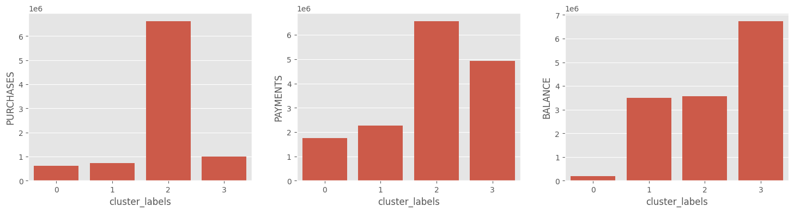  
*Gambar 6.4.32 Visualisasi Distribusi Rata-rata Pembelian, Pembayaran, dan Saldo per Klaster*

##### Rangkuman Segmentasi Profil Nasabah:
1. **Cluster 0 — Nasabah Inaktif / Saldo Rendah (*Low Engagement Customers*):**  
   - Memiliki jumlah terendah dalam `PURCHASES`, `PAYMENTS`, dan `BALANCE`.  
   - Nasabah pada segmen ini jarang menggunakan kartu kredit, baik untuk berbelanja maupun menarik uang tunai.  
   - *Strategi Bisnis:* Diberikan program aktivasi kartu, promo bebas biaya tahunan (*annual fee waiver*), dan diskon transaksi pertama untuk meningkatkan utilisasi kartu.
2. **Cluster 1 — Nasabah Transaksi Rutin / Moderat (*Moderate Balanced Spenders*):**  
   - Memiliki nilai moderat/sedang pada ketiga indikator (`PURCHASES`, `PAYMENTS`, dan `BALANCE`).  
   - Menggunakan kartu kredit secara teratur untuk keperluan belanja sehari-hari dengan pola pembayaran tagihan yang tertib dan proporsional.  
   - *Strategi Bisnis:* Penawaran program *reward points*, program *cashback* kategori supermarket atau bahan bakar, dan opsi cicilan 0%.
3. **Cluster 2 — Nasabah Pembeli Aktif / Pengeluaran Tinggi (*High-Spending VIP Transactors*):**  
   - Memiliki jumlah **tertinggi** dalam `PURCHASES` dan `PAYMENTS`, namun nilai `BALANCE` berada di tingkat sedang.  
   - Kelompok nasabah dengan daya beli sangat tinggi yang secara aktif berbelanja dalam nominal besar, dan secara konsisten segera melunasi tagihannya (*prime customers*).  
   - *Strategi Bisnis:* Peningkatan limit kredit (*credit limit increase*), penawaran kartu kredit tier premium (Platinum/Infinite), layanan prioritas bandara, dan fasilitas *concierge*.
4. **Cluster 3 — Nasabah Saldo Tinggi / Pengguna Fasilitas Dana Tunai (*High-Balance Revolvers*):**  
   - Memiliki nilai sedang dalam `PURCHASES` dan `PAYMENTS`, namun mencatatkan nilai `BALANCE` dan `CASH_ADVANCE` **paling tinggi**.  
   - Kelompok ini cenderung mempertahankan saldo utang bergulir dan sering memanfaatkan fasilitas penarikan uang tunai di muka. Segmen ini menghasilkan pendapatan bunga (*interest margin*) yang signifikan bagi bank, namun memiliki profil risiko kredit yang lebih tinggi.  
   - *Strategi Bisnis:* Program restrukturisasi cicilan tetap dengan bunga kompetitif, peringatan tagihan rutin untuk memitigasi risiko gagal bayar (*default risk*), serta asuransi perlindungan kredit.

---

### 6.5 TUGAS DAN ANALISIS

#### 1. Dataset Preparation: Credit Card Dataset for Clustering
- **Tautan Unduhan:** https://www.kaggle.com/datasets/arjunbhasin2013/ccdata  
- **Tujuan Penggunaan Dataset:**  
  Dataset ini digunakan untuk mengembangkan model segmentasi nasabah kartu kredit berbasis *unsupervised learning*. Melalui identifikasi kelompok perilaku belanja, pembayaran, dan pemanfaatan limit, manajemen perbankan dapat merumuskan strategi penawaran produk yang dipersonalisasi (*targeted marketing*), mengoptimalkan penetapan batas kredit (*credit risk management*), serta mengurangi risiko nasabah berhenti menggunakan layanan (*churn reduction*).

- **Deskripsi Fitur Dataset (18 Kolom Lengkap):**
  1. `CUST_ID`: Nomor identifikasi unik pemegang kartu kredit (*Categorical/String*, dihapus saat pemodelan).
  2. `BALANCE`: Jumlah saldo utang tersisa di rekening kartu kredit yang belum dilunasi.
  3. `BALANCE_FREQUENCY`: Seberapa sering saldo diperbarui, dengan rasio skor antara 0 (tidak pernah) hingga 1 (selalu diperbarui secara berkala).
  4. `PURCHASES`: Akumulasi nominal pembelian yang dilakukan oleh nasabah selama periode observasi.
  5. `ONEOFF_PURCHASES`: Nominal transaksi pembelian terbesar yang dibayarkan secara langsung/penuh (*one-off transaction*).
  6. `INSTALLMENTS_PURCHASES`: Akumulasi nominal transaksi pembelian yang dilakukan menggunakan skema cicilan berkala.
  7. `CASH_ADVANCE`: Total nominal penarikan uang tunai di muka (*cash advance*) yang ditarik melalui mesin ATM.
  8. `PURCHASES_FREQUENCY`: Frekuensi transaksi pembelian yang dilakukan nasabah (rasio skor antara 0 hingga 1).
  9. `ONEOFF_PURCHASES_FREQUENCY`: Frekuensi transaksi pembelian sekaligus (rasio 0 hingga 1).
  10. `PURCHASES_INSTALLMENTS_FREQUENCY`: Frekuensi transaksi belanja dengan metode cicilan bertahap (rasio 0 hingga 1).
  11. `CASH_ADVANCE_FREQUENCY`: Frekuensi nasabah melakukan transaksi penarikan uang tunai di muka (rasio 0 hingga 1).
  12. `CASH_ADVANCE_TRX`: Jumlah total transaksi penarikan dana tunai di muka yang berhasil dilakukan.
  13. `PURCHASES_TRX`: Jumlah total transaksi pembelian yang dilakukan oleh nasabah.
  14. `CREDIT_LIMIT`: Batas pagu kredit maksimum yang dialokasikan oleh penerbit kartu kepada nasabah.
  15. `PAYMENTS`: Total nominal pembayaran tagihan yang telah disetorkan oleh nasabah.
  16. `MINIMUM_PAYMENTS`: Total nominal pembayaran minimum yang telah dibayarkan oleh nasabah.
  17. `PRC_FULL_PAYMENT`: Persentase pembayaran tagihan yang dilunasi secara penuh (100%) oleh nasabah.
  18. `TENURE`: Masa berlaku kepemilikan kartu kredit oleh nasabah (dihitung dalam satuan bulan, rentang 6 hingga 12 bulan).

---

#### 2. Eksperimen Dataset Tambahan: Air Traffic Passengers Statistics
- **Tautan Unduhan:** https://data.sfgov.org/Transportation/Air-Traffic-Passenger-Statistics/rkru-6vcg/about_data  
- **Tahapan Eksperimen Mahasiswa:**
  1. Unduh dataset statistik lalu lintas penumpang maskapai penerbangan dari portal resmi SFGov.
  2. Lakukan inspeksi struktur data dan tangani kolom-kolom bertipe data string/kategorikal menggunakan `LabelEncoder` dari pustaka `sklearn.preprocessing`:

```python
from sklearn.preprocessing import LabelEncoder

# Identifikasi fitur kategorikal
cats = df_air.select_dtypes(include=['object', 'bool']).columns
cat_features = list(cats.values)

# Transformasi label encoding
le = LabelEncoder()
for col in cat_features:
    df_air[col] = le.fit_transform(df_air[col])
```

  3. Lakukan standarisasi data numerik menggunakan `StandardScaler`.
  4. Tentukan jumlah klaster optimal ($K$) menggunakan *Elbow Method* dan *Silhouette Score*.
  5. Terapkan algoritma K-Means dan K-Medoids, kemudian bandingkan segmentasi maskapai/penumpang yang dihasilkan.
  6. Sajikan analisis perbandingan mengenai ketahanan kedua algoritma terhadap *outlier* pada data operasional penerbangan.

---

### 6.6 REFERENSI
- Afidaha, M. W., & Masrukan, M. H. (2023). Penerapan Metode Clustering dengan Algoritma K-Means untuk Pengelompokkan Data Migrasi Penduduk Tiap Kecamatan di Kabupaten Rembang. *PRISMA, Prosiding Seminar Nasional Matematika* (pp. 729-738). Semarang: Universitas Negeri Semarang.
- Agrawal, R., & Srikant, R. (1994). Fast algorithms for mining association rules in large databases. *Proceedings of the 20th International Conference on Very Large Data Bases (VLDB)*, 487–499.
- Agrawal, R., Imieliński, T., & Swami, A. (1993). Mining association rules between sets of items in large databases. *Proceedings of the 1993 ACM SIGMOD International Conference on Management of Data*, 207–216.
- Bishop, C. M. (2006). *Pattern Recognition and Machine Learning*. New York: Springer.
- Ester, M., Kriegel, H.-P., Sander, J., & Xu, X. (1996). A density-based algorithm for discovering clusters in large spatial databases with noise. *Proceedings of the Second International Conference on Knowledge Discovery and Data Mining (KDD)*, 226–231.
- Han, J., Kamber, M., & Pei, J. (2011). *Data Mining: Concepts and Techniques* (3rd ed.). Waltham: Morgan Kaufmann.
- Herviany, N., Delima, R., Nurhidayah, S., & Kasini, A. (2021). Perbandingan Algoritma K-Means dan K-Medoids untuk Pengelompokkan Daerah Rawan Tanah Longsor di Provinsi Jawa Barat. *MALCOM: Indonesian Journal of Machine Learning and Computer Science*, 1(1), 34-40.
- Kaufman, L., & Rousseeuw, P. J. (1990). *Finding Groups in Data: An Introduction to Cluster Analysis*. Hoboken: John Wiley & Sons.
- Nurhalizah, S., & Ardianto, D. (2024). Penerapan Unsupervised Learning dalam Analisis Pola Data. *Jurnal Sains Komputer dan Informatika*, 8(1), 112–121.
- Rousseeuw, P. J. (1987). Silhouettes: A graphical aid to the interpretation and validation of cluster analysis. *Journal of Computational and Applied Mathematics*, 20, 53–65.
- Sander, J., Ester, M., Kriegel, H.-P., & Xu, X. (1998). Density-based clustering in spatial databases: The algorithm GDBSCAN and its applications. *Data Mining and Knowledge Discovery*, 2(2), 169–194.
- Sulistiyawati, A., & Supriyanto, E. (2021). Pengelompokan Data Menggunakan Metode K-Means untuk Analisis Cluster. *Jurnal Matematika dan Statistika*, 17(2), 85–94.
- Tan, P.-N., Steinbach, M., Karpatne, A., & Kumar, V. (2019). *Introduction to Data Mining* (2nd ed.). Boston: Pearson.
- Wijoyo, S., et al. (2024). Unsupervised Learning and Its Application in Pattern Discovery. *Jurnal Teknologi Informasi dan Sains Data*, 6(2), 45–54.
- scikit-learn developers. (2024). *Clustering Performance Evaluation – Inertia & Silhouette Score Documentation*. Diakses dari https://scikit-learn.org/stable/modules/clustering.html
