# Modul Praktikum Penambangan Data – Teknologi Rekayasa Perangkat Lunak – 2025
## PERTEMUAN VIII: NEURAL NETWORK

### 8.1 TUJUAN PEMBELAJARAN
A. Mahasiswa memahami konsep dasar *Multilayer Perceptron* (MLP) dan mampu menerapkannya pada teknik klasifikasi dan regresi.  
B. Mahasiswa mampu menganalisis hasil klasifikasi menggunakan MLP dengan memanfaatkan metrik evaluasi (*accuracy*, *precision*, *recall*, *F1-score*, dan *confusion matrix*).  
C. Mahasiswa mampu menganalisis hasil regresi menggunakan MLP dengan membandingkan hasil prediksi terhadap data aktual menggunakan metrik evaluasi seperti $R^2$ dan RMSE.  

---

### 8.2 DASAR TEORI

**• Neural Network**  
*Neural Network* atau Jaringan Saraf Tiruan (JST) merupakan arsitektur komputasi yang terinspirasi oleh struktur jaringan neuron biologis pada otak manusia. JST memetakan lapisan masukan (*input layer*) menuju lapisan keluaran (*output layer*) melalui satu atau lebih lapisan tersembunyi (*hidden layers*). JST merupakan teknik pemodelan non-linier yang mampu memetakan fungsi-fungsi kompleks dan pola tersembunyi pada data bervolume besar untuk keperluan estimasi numerik maupun klasifikasi kategori (Hukubun, 2022).

**• Multilayer Perceptron (MLP)**  
*Multilayer Perceptron* (MLP) adalah arsitektur *feedforward neural network* yang terdiri dari setidaknya tiga lapisan node: *input layer*, satu atau beberapa *hidden layers*, dan *output layer*. Setiap neuron di suatu lapisan terhubung penuh (*fully connected*) dengan neuron pada lapisan berikutnya.  
Kelebihan utama MLP adalah kemampuannya memodelkan hubungan non-linier antara variabel fitur dan target melalui fungsi aktivasi non-linier, adaptif terhadap distribusi data, dan lebih tahan terhadap derau (*noise*) (Pardede, Hayadi, & Iskandar, 2022).

**• Backpropagation Learning**  
*Backpropagation* (propagasi balik) adalah algoritma pembelajaran terawasi (*supervised learning*) yang digunakan untuk memperbarui bobot (*weights*) dan bias antar-neuron dalam jaringan. Algoritma ini menghitung gradien dari fungsi rugi (*loss function*) terhadap setiap bobot menggunakan aturan rantai kalkulus (*chain rule*). Galat (*error*) dihitung di lapisan keluaran lalu dipropagrasikan mundur ke lapisan-lapisan sebelumnya untuk meminimalkan nilai rugi melalui algoritma optimasi seperti *Stochastic Gradient Descent* (SGD) atau Adam (Goodfellow, Bengio, & Courville, 2016; Haykin, 2009).

**• Activation Function**  
Fungsi aktivasi bertanggung jawab mentransformasikan kombinasi linier dari bobot dan input menjadi output non-linier pada suatu neuron. Tanpa fungsi aktivasi, jaringan saraf tiruan berapapun dalamnya hanya akan setara dengan sebuah model regresi linier sederhana. Beberapa fungsi aktivasi yang umum digunakan:
1. **Sigmoid**: $\sigma(z) = \frac{1}{1 + e^{-z}}$, memetakan nilai ke rentang $(0, 1)$, sering digunakan pada klasifikasi biner.
2. **Tanh**: memetakan nilai ke rentang $(-1, 1)$.
3. **ReLU (Rectified Linear Unit)**: $f(z) = \max(0, z)$, sangat populer karena mengatasi masalah *vanishing gradient* dan komputasinya efisien.
4. **Softmax**: memetakan vektor nilai keluaran menjadi distribusi probabilitas kelas pada klasifikasi multi-kelas (Nielsen, 2015).

**• Klasifikasi**  
Klasifikasi adalah metode *supervised learning* untuk memetakan input ke dalam label atau kategori diskret tertentu. Model dilatih menggunakan pasangan fitur dan label aktual untuk mempelajari batas keputusan (*decision boundary*). Pada MLP untuk klasifikasi (`MLPClassifier`), fungsi aktivasi pada output layer biasanya adalah *sigmoid* (biner) atau *softmax* (multi-kelas), dengan fungsi kerugian *Cross-Entropy* (Roihan, Sunarya, & Rafika, 2020).

**• Regresi**  
Regresi bertujuan untuk memprediksi nilai target kontinu (numerik). Pada MLP untuk regresi (`MLPRegressor`), lapisan keluaran umumnya menggunakan fungsi aktivasi linier (*identity*) tanpa transformasi batasan nilai, dan fungsi kerugian yang dioptimalkan adalah *Mean Squared Error* (MSE) (Mardiani, et al., 2023).

---

### 8.3 ALAT DAN BAHAN

**A. Perangkat Keras**  
1. Komputer / Laptop dengan minimal RAM 4 GB  
2. Akses internet stabil  

**B. Perangkat Lunak**  
1. Web Browser (Google Chrome, Microsoft Edge, Mozilla Firefox, dll.)  
2. Google Colaboratory / Jupyter Notebook  
3. Pustaka Python: `pandas`, `numpy`, `scikit-learn` (`MLPClassifier`, `MLPRegressor`), `matplotlib`, `seaborn`  

---

### 8.4 LANGKAH PERCOBAAN

#### 1. Persiapkan IDE
Membuka lingkungan Google Colab sebagai platform eksperimen. Colab menyediakan lingkungan komputasi Python interaktif lengkap dengan pustaka *data science* serta dukungan CPU/GPU gratis.

#### 2. Instalasi dan Impor Library
Mengimpor modul-modul pendukung manipulasi data, pra-pemrosesan, visualisasi, dan pemodelan Neural Network:
- `pandas` dan `numpy` untuk operasi array dan dataframe.
- `matplotlib.pyplot` dan `seaborn` untuk eksplorasi visual dan plotting performa.
- `StandardScaler`, `train_test_split`, `LabelEncoder` dari `sklearn.preprocessing` / `model_selection`.
- `MLPClassifier` dan `MLPRegressor` dari `sklearn.neural_network`.
- Metrik evaluasi: `confusion_matrix`, `classification_report`, `mean_squared_error`, `r2_score`.

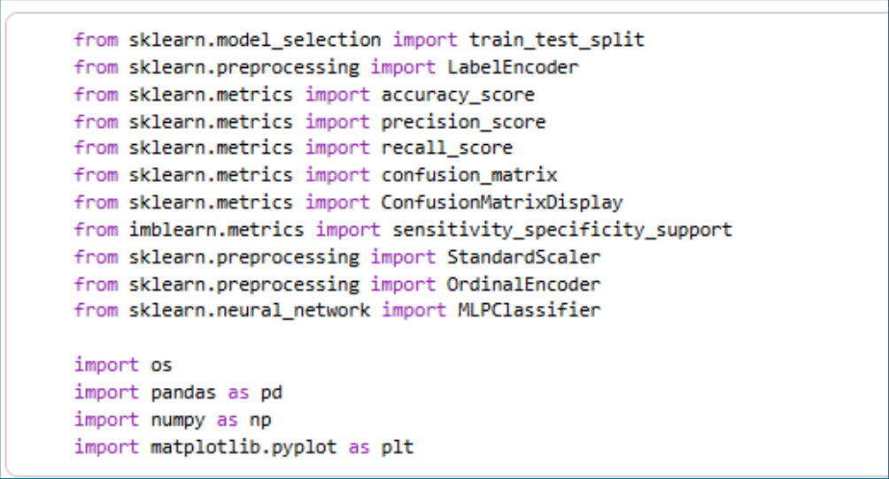  
*Gambar 8.4.1 Impor Pustaka*

#### 3. Import dan Load Dataset Information
Dua dataset digunakan dalam percobaan ini:
1. **Dataset Klasifikasi**: *Bank Customer Churn Dataset* untuk memprediksi kecenderungan nasabah keluar (*churn*).
2. **Dataset Regresi**: *King County House Sales* (`kc_house_data.csv`) untuk memprediksi harga penjualan rumah.

#### 4. Exploratory Data Analysis (EDA)
Melakukan eksplorasi awal meliputi visualisasi distribusi fitur, korelasi antar-variabel, dan pemeriksaan keseimbangan kelas target.

#### 5. Data Cleaning & Preprocessing
Pemeriksaan *missing values*, penanganan variabel kategorikal melalui teknik *encoding*, dan normalisasi/standarisasi fitur numerik menggunakan `StandardScaler`. Standarisasi sangat krusial bagi MLP agar gradien algoritma optimasi stabil dan cepat konvergen.

#### 6. MLP untuk Klasifikasi (Bank Customer Churn)
1. Menampilkan data awal dan akhir dengan `.head()` dan `.tail()`:

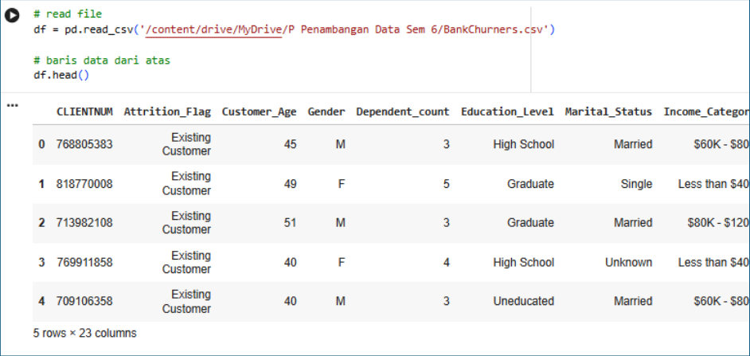  
*Gambar 8.4.2 Membaca dataset*

2. Menganalisis sebaran variabel numerik menggunakan histogram:

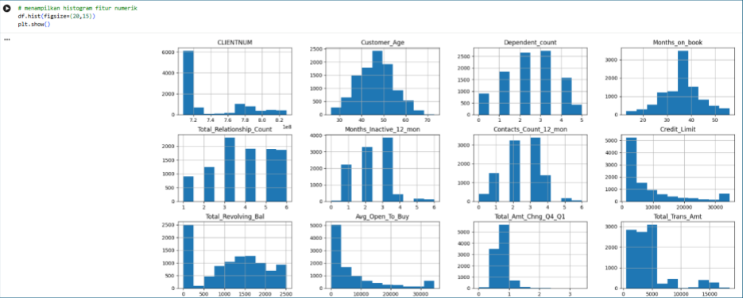  
*Gambar 8.4.3 Menganalisis dataset*

3. Memeriksa proporsi kelas target klasifikasi:

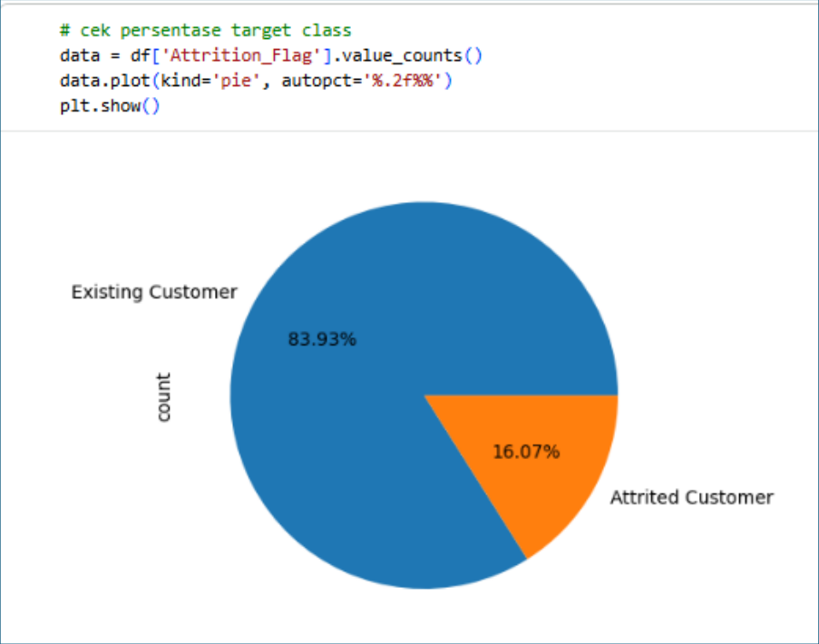  
*Gambar 8.4.4 Mengecek proporsi data*

4. Memeriksa keberadaan nilai hilang (*null values*):

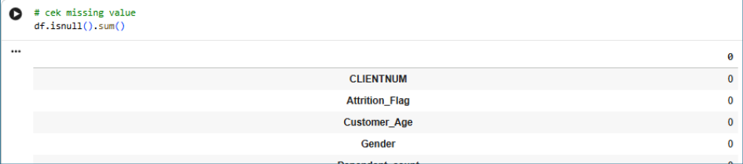  
*Gambar 8.4.5 Mengecek nilai null*

5. Mengidentifikasi atribut kategorikal dan numerik:

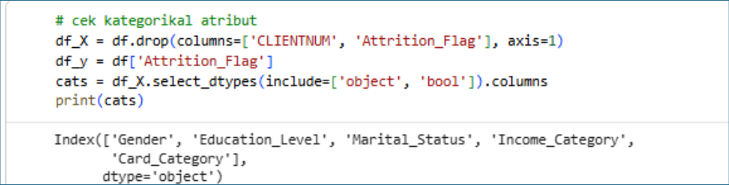  
*Gambar 8.4.6 Mengindetifikasi atribut kategorikal dan numerik*

6. Membagi data menjadi data pelatihan (*train*) dan pengujian (*test*):

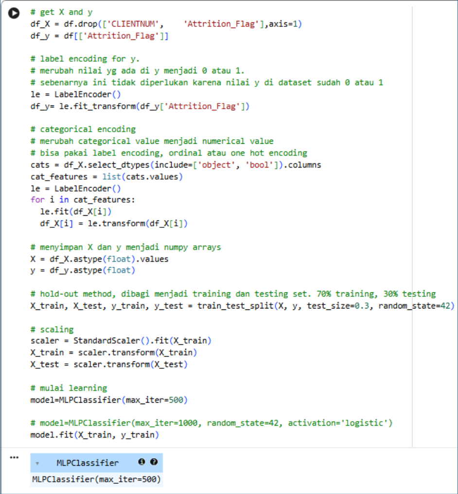  
*Gambar 8.4.7 Pembagian data training dan testing*

7. Menampilkan koefisien bobot dari model:

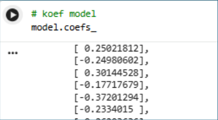  
*Gambar 8.4.8 Koefisien model*

8. Visualisasi data dan grafik korelasi fitur:

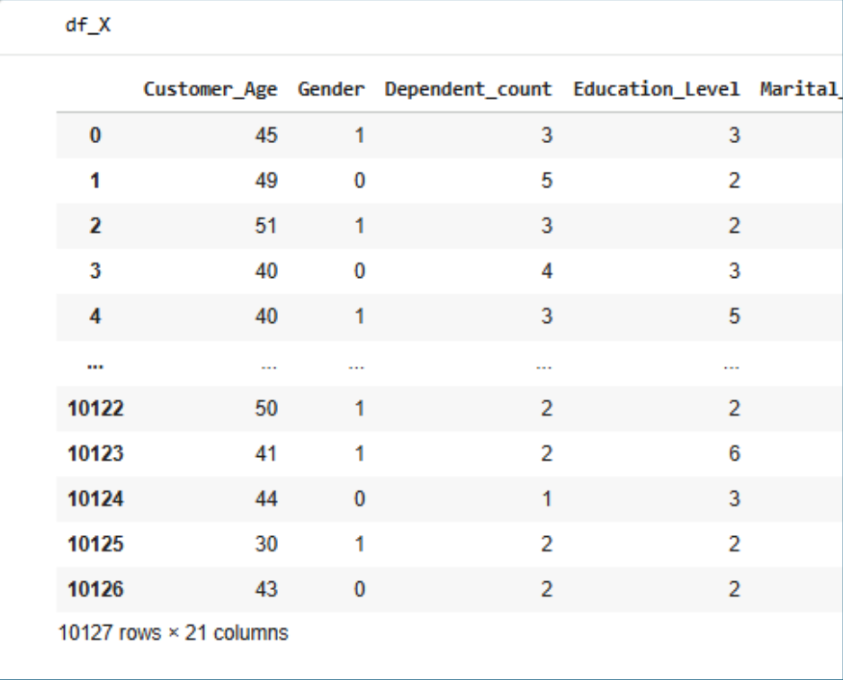  
*Gambar 8.4.9 Visualisasi Data*

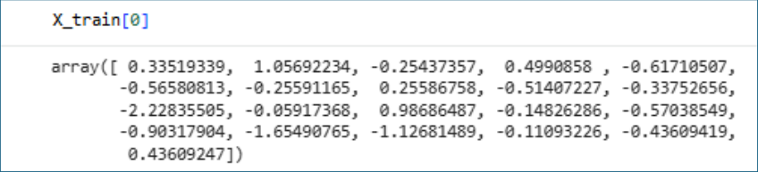  
*Gambar 8.4.10 Visualisasi Data*

9. Evaluasi performa model klasifikasi menggunakan matriks kebingungan (*Confusion Matrix*):

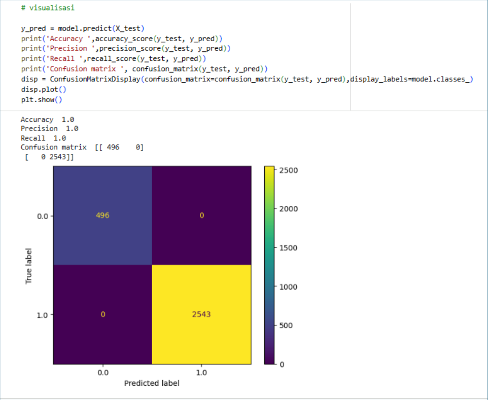  
*Gambar 8.4.11 Visualisasi Confusion Matrix*

10. Melatih model dengan `MLPClassifier`:

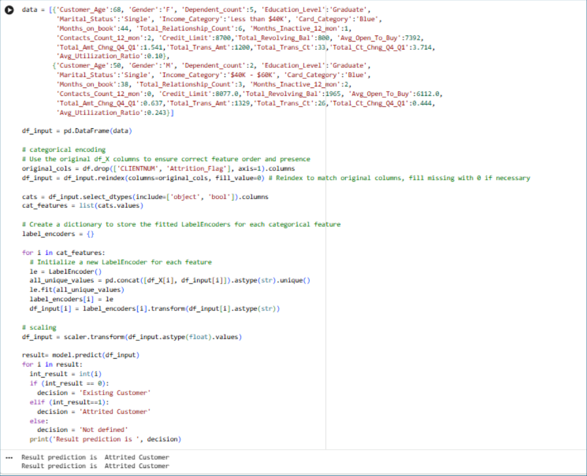  
*Gambar 8.4.12 Melatih model MLP*

11. Menampilkan hasil prediksi kelas:

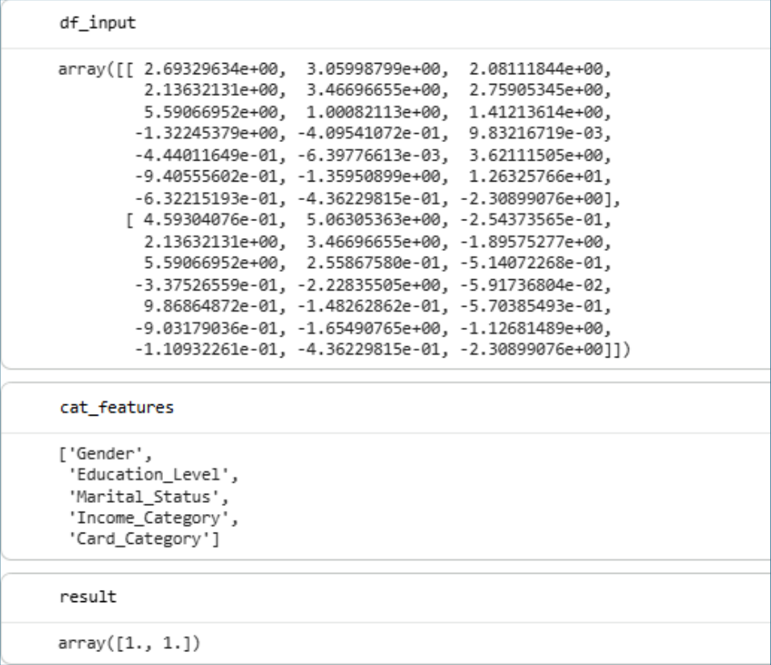  
*Gambar 8.4.13 Melihat hasil prediksi*

---

#### 7. MLP untuk Regresi (KC House Sales)
Membangun model `MLPRegressor` untuk memprediksi harga rumah kontinu:

1. Membaca dataset regresi dan melihat sampel awal:

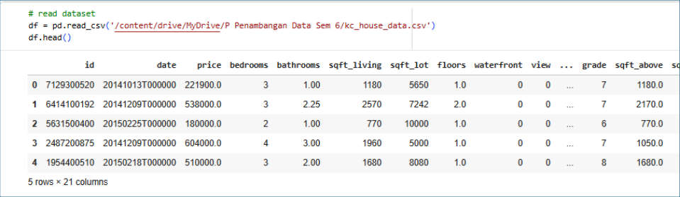  
*Gambar 8.4.14 Membaca dataset*

2. Memeriksa keberadaan *missing values*:

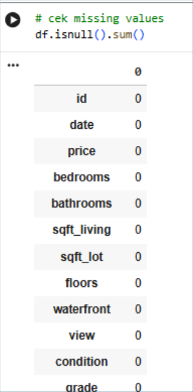  
*Gambar 8.4.15 Mengecek missing value*

3. Menampilkan histogram fitur numerik:

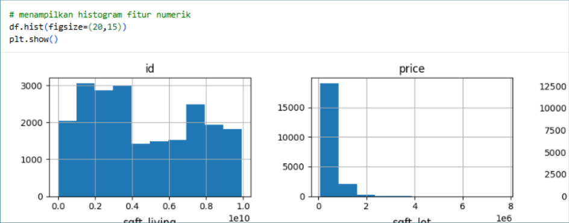  
*Gambar 8.4.16 Histogram fitur numerik*

4. Mengukur performa awal model regresi:

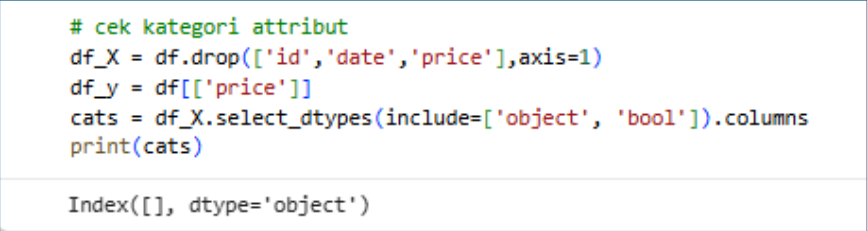  
*Gambar 8.4.17 Mengecek Performa*

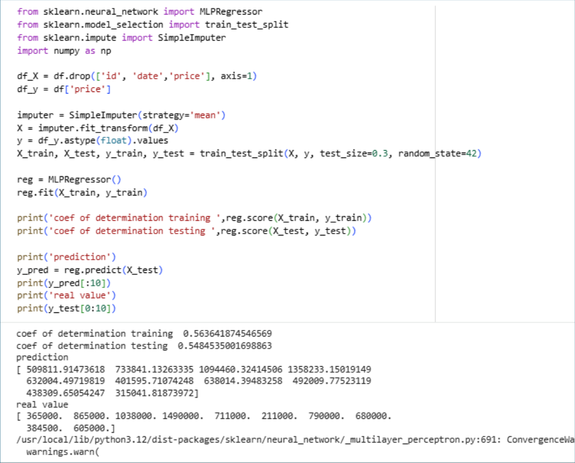  
*Gambar 8.4.18 Mengecek performa*

5. Menghitung evaluasi performa model menggunakan metrik $R^2$ (*Coefficient of Determination*) dan RMSE:

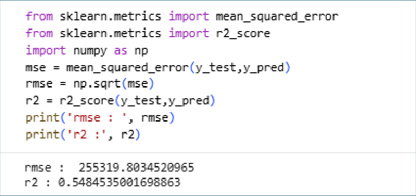  
*Gambar 8.4.19 Evaluasi model*

6. Membuat grafik visualisasi perbandingan antara nilai prediksi model vs nilai riil aktual:

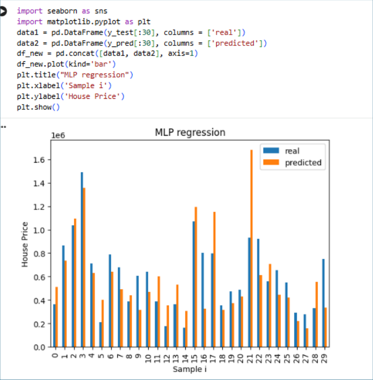  
*Gambar 8.4.20 Visualisasi hasil prediksi*

---

### 8.5 TUGAS DAN ANALISIS
1. **Tugas 1 (Pemahaman Dataset):**
   - Unduh dataset: *Bank Customer Churn Dataset* dan `kc_house_data`.
   - Jelaskan latar belakang dan tujuan penggunaan masing-masing dataset tersebut.
   - Uraikan karakteristik seluruh fitur yang tersedia pada kedua dataset.
2. **Tugas 2 (Eksperimen Pemodelan MLP Mandiri):**
   - Cari dan pilih sebuah dataset baru untuk studi kasus klasifikasi, kemudian bangun model `MLPClassifier`.
   - Cari dan pilih sebuah dataset baru untuk studi kasus regresi, kemudian bangun model `MLPRegressor`.
   - Tampilkan tabel evaluasi performa lengkap untuk masing-masing model (akurasi, presisi, recall, F1 untuk klasifikasi; MAE, RMSE, $R^2$ untuk regresi).

---

### 8.6 REFERENSI
- Goodfellow, I., Bengio, Y., & Courville, A. (2016). *Deep Learning*. MIT Press.
- Haykin, S. (2009). *Neural Networks and Learning Machines* (3rd ed.). Pearson.
- Hukubun, A. J. (2022). Neural Network. *ResearchGate Publication*: https://www.researchgate.net/publication/365581579_Neural_Network
- Mardiani, E., Rahmansyah, N., Ningsih, S., Lantana, D. A., Wirawan, A. S., Wijaya, S. A., & Putri, D. N. (2023). Komparasi Metode KNN, Naive Bayes, Decision Tree, Ensemble, Linear Regression Terhadap Analisis Performa Pelajar SMA. *INNOVATIVE: Journal Of Social Science Research*, 13880-13892.
- Nielsen, M. A. (2015). *Neural Networks and Deep Learning: A Textbook*. Determination Press.
- Pardede, D., Hayadi, B. H., & Iskandar. (2022). Kajian Literatur Multi Layer Perceptron: Seberapa Baik Performa Algoritma Ini. *Journal of ICT Application and System*, 23-34.
- Roihan, A., Sunarya, P. A., & Rafika, A. S. (2020). Pemanfaatan Machine Learning dalam Berbagai Bidang: Review Paper. *IJCIT (Indonesian Journal on Computer and Information Technology)*, 75-82.
