# Modul Praktikum Penambangan Data – Teknologi Rekayasa Perangkat Lunak – 2025
## PERTEMUAN IX: CONVOLUTIONAL NEURAL NETWORK

### 9.1 TUJUAN PEMBELAJARAN
A. Memahami keterbatasan *Multi-Layer Perceptron* (MLP) dalam pengelolaan citra digital dan keunggulan arsitektur *Convolutional Neural Network* (CNN).  
B. Menjelaskan arsitektur dasar CNN: *Convolution Layer*, *Activation Function* (ReLU), *Pooling Layer*, *Flattening*, dan *Fully Connected Layer* (Dense).  
C. Membangun model CNN sederhana menggunakan framework Keras / TensorFlow.  
D. Menerapkan teknik regularisasi *Dropout* untuk mencegah *overfitting*.  

---

### 9.2 DASAR TEORI

**• Representasi Citra dan Keterbatasan MLP**  
Komputer melihat citra sebagai sekumpulan matriks/array piksel. Jika sebuah citra berukuran $300 \times 300$, maka dimensi array-nya adalah $300 \times 300 \times 3$ (untuk tiga kanal warna RGB: Red, Green, Blue). Setiap elemen piksel merepresentasikan intensitas cahaya bernilai diskret antara 0 hingga 255.

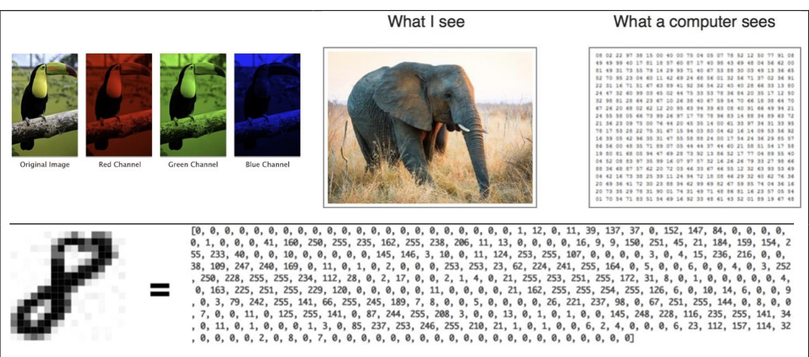  
*Gambar 9.2.1 Penglihatan Manusia vs Komputer*

Sebelum berkembangnya *Deep Learning*, klasifikasi citra tradisional memisahkan proses ekstraksi fitur (*hand-crafted feature extraction*) dan klasifikasi. Ketika metode tradisional seperti MLP (*Multi-Layer Perceptron*) langsung diaplikasikan pada citra mentah, muncul beberapa kelemahan fundamental:

1. **Jumlah Parameter yang Sangat Besar (*Parameter Explosion*):**  
   Citra berukuran kecil $16 \times 16$ saja jika dihubungkan langsung ke *hidden layer* yang berisi ribuan node akan menghasilkan puluhan hingga ratusan ribu bobot (*weights*), yang membebani komputasi dan memori.

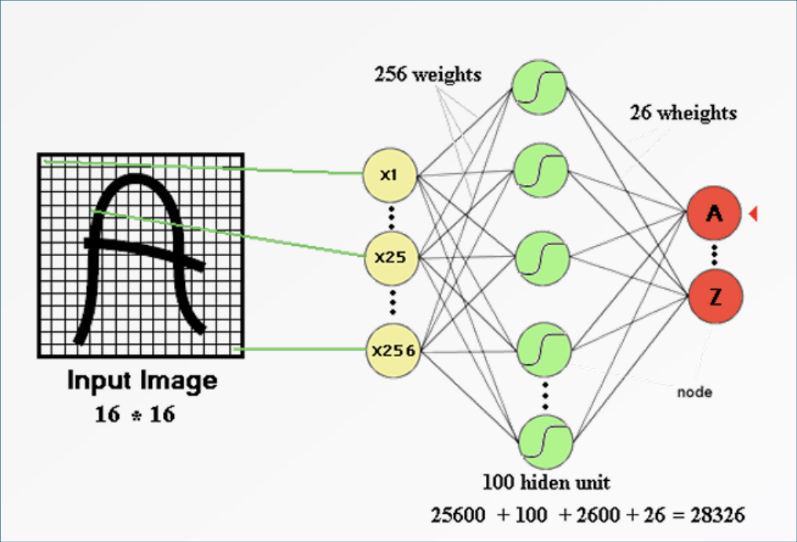  
*Gambar 9.2.2 Hidden Layer MLP*

2. **Hilangnya Invariansi Spasial (*Spatial Invariance*):**  
   MLP mengharuskan perataan citra menjadi vektor 1D (*flattening*) di awal, sehingga hubungan ketetanggaan spasial antar-piksel hilang. Akibatnya, MLP tidak tahan terhadap pergeseran (*shift*), penskalaan (*scale*), atau rotasi objek. Jika posisi objek bergeser sedikit saja, MLP cenderung gagal mengenalinya.

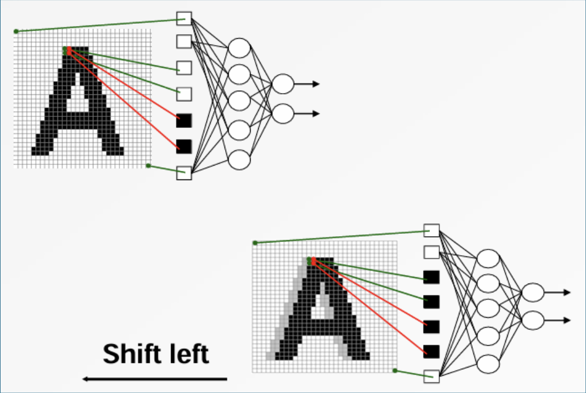  
*Gambar 9.2.3 Pergeseran Citra pada MLP*

Berikut adalah perbandingan ilustrasi antara alur pendekatan klasifikasi tradisional dibandingkan pendekatan *Deep Learning*:

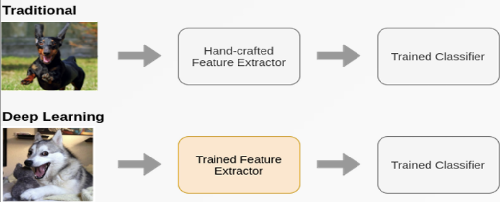  
*Gambar 9.2.4 Ilustrasi Alur Tradisional vs Deep Learning*

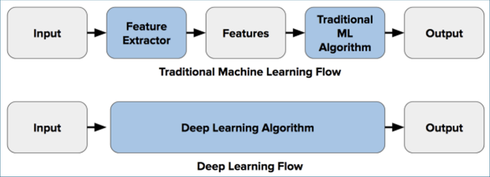  
*Gambar 9.2.5 Ilustrasi Alur Tradisional vs Deep Learning*

---

**• Arsitektur Convolutional Neural Network (CNN)**  
CNN adalah arsitektur *feed-forward neural network* khusus yang dirancang untuk mengekstrak pola hierarki visual langsung dari piksel mentah dengan pra-pemrosesan minimal. Alur komponen utama CNN meliputi:

1. **Convolution Layer (Lapisan Konvolusi):**  
   Inti dari CNN. Lapisan ini menggunakan sejumlah filter/kernel berukuran kecil (misalnya $3 \times 3$ atau $5 \times 5$) yang bergeser (*stride*) di atas citra input untuk melakukan perkalian titik (*dot product*). Setiap filter menghasilkan representasi fitur spasial yang disebut *Feature Map* (mendeteksi tepi, tekstur, sudut, pola warna, dll.).
2. **ReLU (Rectified Linear Unit):**  
   Fungsi aktivasi non-linier yang diterapkan setelah konvolusi:
   $$\Phi(x) = \max(0, x)$$
   Mengubah seluruh nilai piksel negatif menjadi 0 agar jaringan mampu mempelajari relasi non-linier yang kompleks.
3. **Pooling Layer (Subsampling / Downsampling):**  
   Berfungsi mereduksi dimensi spasial (*width* & *height*) dari feature map untuk menghemat beban komputasi dan memberikan sifat translasi-invarian (*translation invariance*). Teknik paling umum adalah **Max Pooling** yang mengambil nilai intensitas tertinggi di dalam suatu jendela (misalnya $2 \times 2$).
4. **Flattening:**  
   Mengubah matriks fitur multi-dimensi dari lapisan pooling terakhir menjadi satu vektor satu dimensi (1D) agar dapat diteruskan ke jaringan syaraf terhubung penuh (*dense network*).
5. **Fully Connected Layer (Dense):**  
   Bertindak sebagai lapisan pengklasifikasi (*classifier*). Menghubungkan seluruh fitur yang telah diekstrak ke sejumlah neuron keluaran yang mewakili probabilitas setiap kelas (misalnya: *Cat* vs *Dog*).

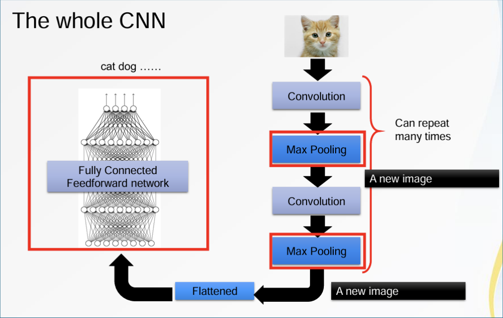  
*Gambar 9.2.6 Alur CNN secara keseluruhan*

---

**• Dropout Regularization**  
*Dropout* adalah teknik regularisasi di mana sebagian unit neuron dinonaktifkan (*dropped out*) secara acak dengan probabilitas tertentu (misalnya $p = 0.5$ atau $0.2$) selama setiap langkah iterasi pelatihan. Teknik ini mencegah terjadinya adaptasi-bersama antar-neuron (*co-adaptation*) dan sangat efektif meredam *overfitting* pada jaringan saraf tiruan dalam (*deep networks*).

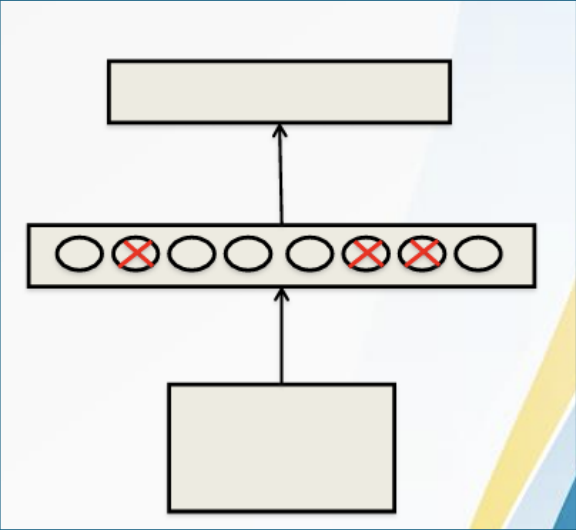  
*Gambar 9.2.7 Dropout*

---

### 9.3 ALAT DAN BAHAN

**• Perangkat Keras**  
- Komputer / Laptop  

**• Perangkat Lunak**  
- Python 3  
- Google Colaboratory (disarankan menggunakan runtime T4 GPU)  

**• Pustaka Python**  
- `tensorflow` / `keras`  
- `matplotlib`  
- `numpy`  

---

### 9.4 LANGKAH PERCOBAAN

Percobaan praktikum ini berfokus pada pembuatan model klasifikasi citra biner: **Dog vs Cat**.

#### 1. Unduh Dataset
Dataset diunduh langsung di Google Colab menggunakan perintah shell berikut:

```bash
!gdown --id "1hOU0OcYc8_za_0SJLc6HALjVc4sfVGNA" -O "datasets.zip"
!unzip -q datasets.zip
!mkdir -p dataset/cat
!mkdir -p dataset/dog
!mv cnn/dataset/cat/* dataset/cat/
!mv cnn/dataset/dog/* dataset/dog/
!rm -rf cnn
```

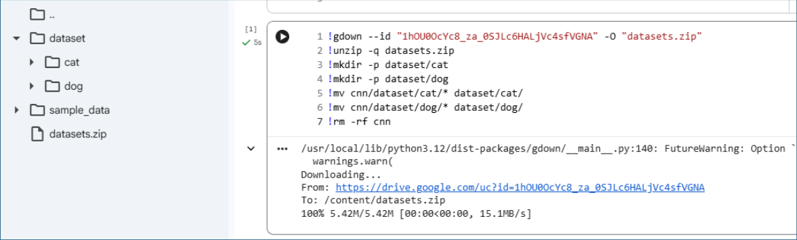  
*Gambar 9.4.1 Unduh Dataset Dog vs Cat*

*Catatan: Jika tautan otomatis bermasalah, dataset dapat diunduh manual melalui tautan Google Drive: `https://drive.google.com/file/d/1hOU0OcYc8_za_0SJLc6HALjVc4sfVGNA` lalu diekstrak ke folder `dataset/cat` dan `dataset/dog`.*

#### 2. Impor Pustaka
Mengimpor pustaka `tensorflow`, `keras`, `matplotlib.pyplot`, dan `numpy`:

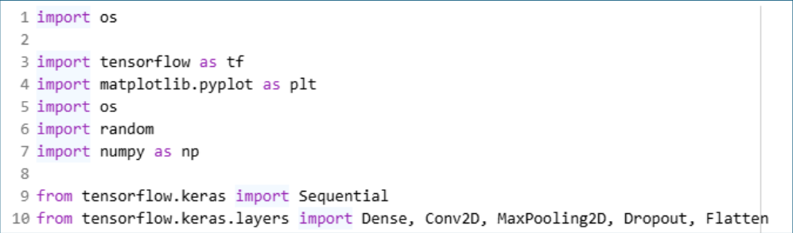  
*Gambar 9.4.2 Import Pustaka*

#### 3. Pembacaan dan Pembagian Dataset
Memuat dataset citra menggunakan `image_dataset_from_directory` dari TensorFlow Keras dengan resolusi target $224 \times 224$ piksel. Data dibagi menjadi 80% data pelatihan (*training*) dan 20% data validasi (*validation*):

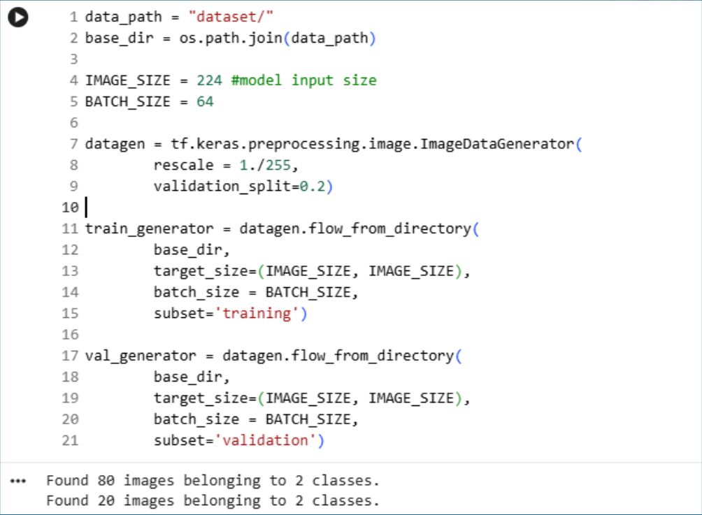  
*Gambar 9.4.3 Data Preparation dan Splitting*

#### 4. Uji Coba Pembacaan Data
Menampilkan sampel citra berserta label kelasnya dari *dataset pipeline* untuk memverifikasi bahwa citra terbaca dengan tepat:

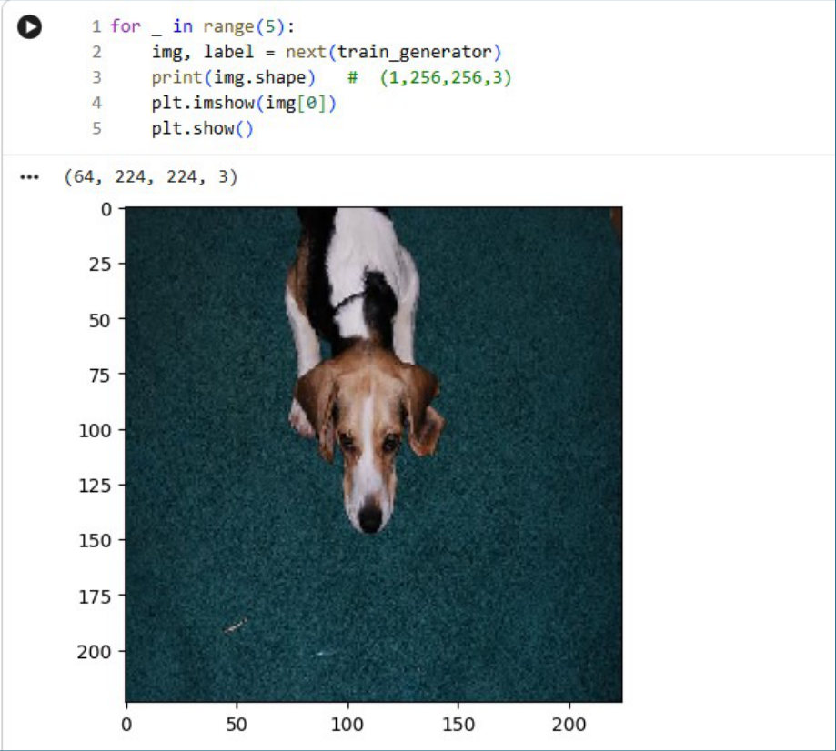  
*Gambar 9.4.4 Pengujian pembacaan data*

#### 5. Cek Bentuk Data (Sanity Check)
Memastikan dimensi *batch* dan bentuk data (*shape*) dengan mendefinisikan `IMG_SHAPE` berdasarkan satu *batch* data aktual:

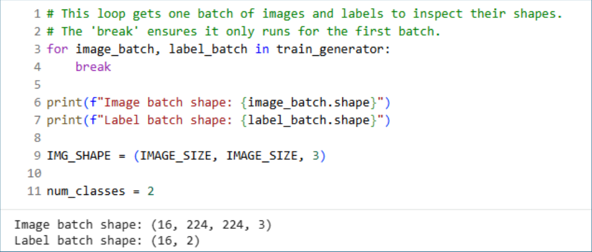  
*Gambar 9.4.5 Pendefinisian IMG_SHAPE dan kelas*

#### 6. Membangun Model CNN Sederhana
Menyusun arsitektur CNN dengan 2 blok konvolusi (`Conv2D` + `MaxPooling2D`), diikuti `Flatten`, `Dense`, dan `Dropout`:

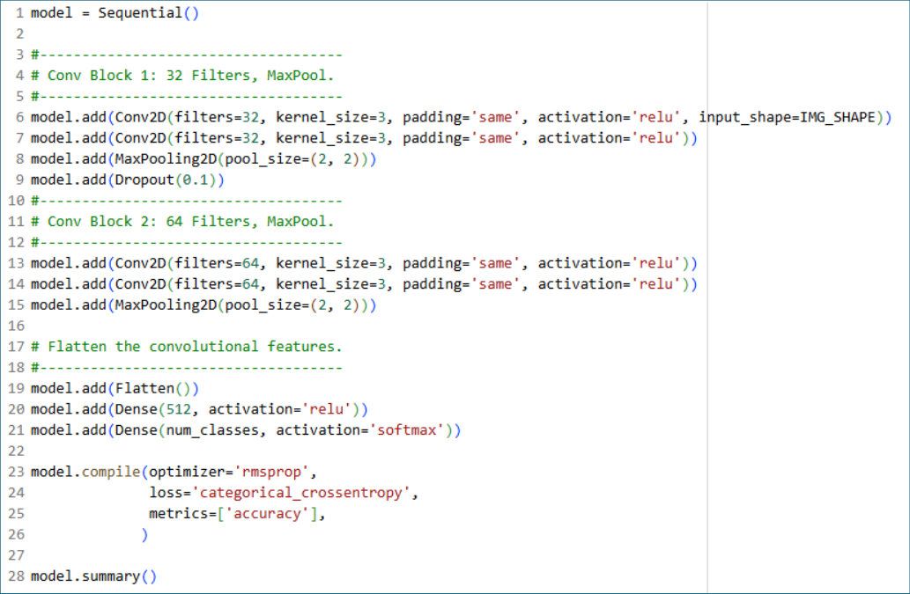  
*Gambar 9.4.6 Model CNN sederhana*

Menampilkan ringkasan arsitektur model (`model.summary()`):

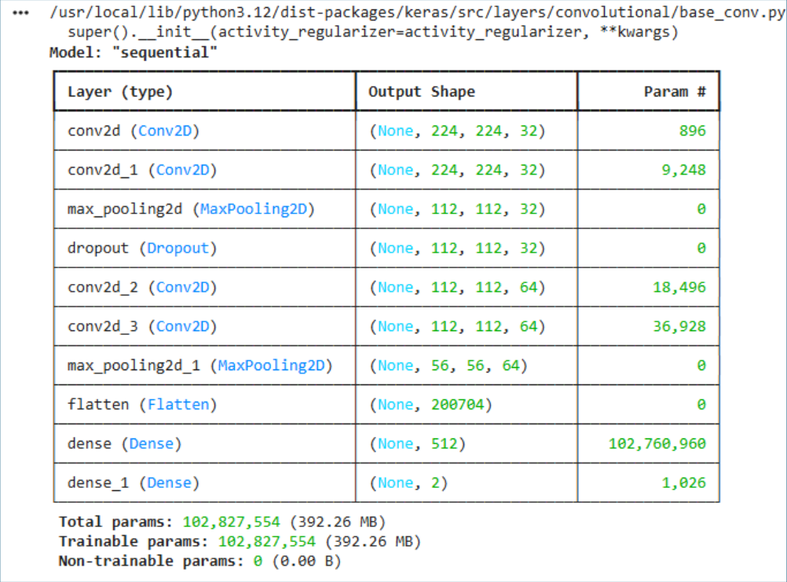  
*Gambar 9.4.7 Ringkasan model CNN sederhana*

#### 7. Melatih Model
Melatih model CNN menggunakan `model.fit()` sebanyak 20 *epochs* dengan data validasi untuk memantau proses pembelajaran:

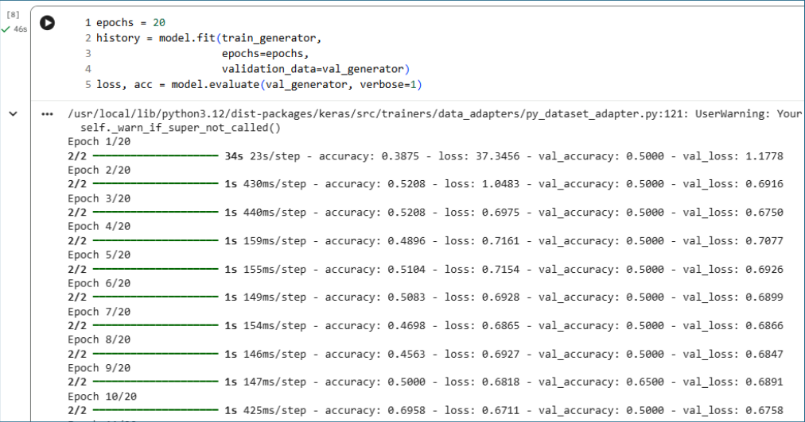  
*Gambar 9.4.8 Latih model CNN sederhana*

#### 8. Evaluasi Performa Model
Memvisualisasikan grafik dinamika *Accuracy* dan *Loss* pada tahap pelatihan dan validasi:

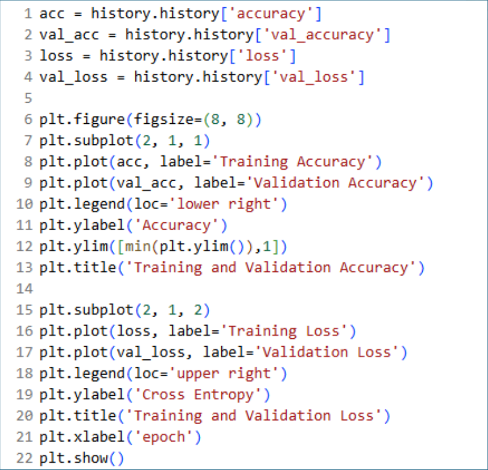  
*Gambar 9.4.9 Kode plot evaluasi*

Hasil plot grafik evaluasi:

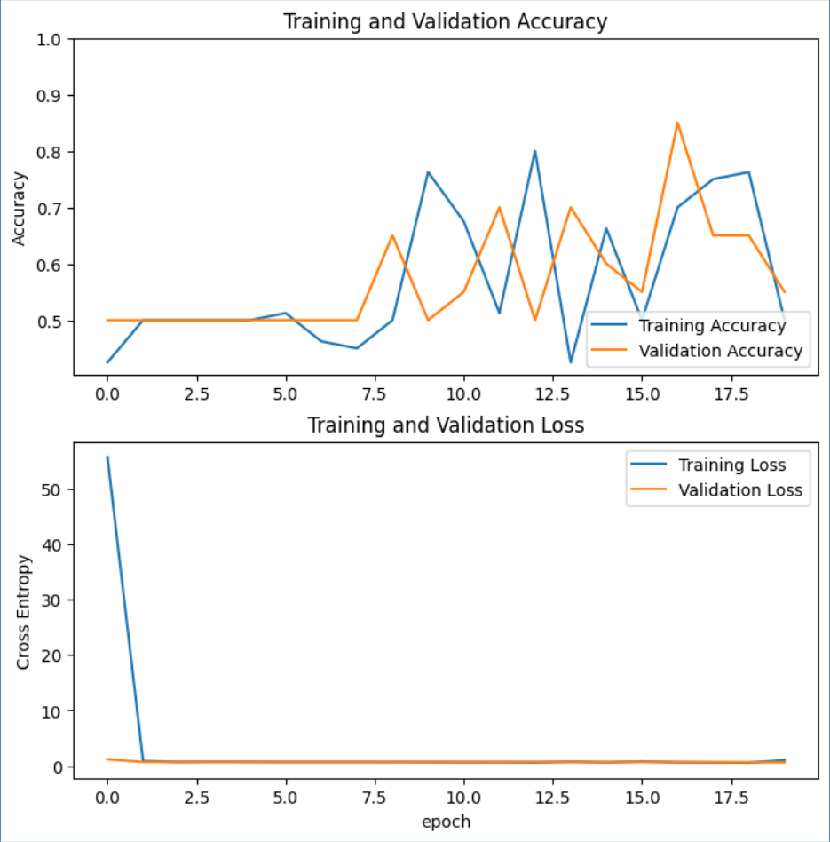  
*Gambar 9.4.10 Plot evaluasi*

---

### 9.5 TUGAS & ANALISIS
1. Carilah dataset citra baru (dapat berupa klasifikasi biner maupun multi-kelas) dari platform publik (Kaggle / HuggingFace). Jumlah sampel tidak harus sangat besar.
2. Bangun sebuah model klasifikasi citra menggunakan arsitektur CNN dengan framework TensorFlow/Keras untuk melatih dan memprediksi dataset tersebut.
3. Tampilkan hasil prediksi berupa metrik evaluasi klasifikasi (*Accuracy*, *Confusion Matrix*) serta visualisasi grafik kurva *Loss* dan *Accuracy* selama proses pelatihan.

---

### 9.6 REFERENSI
- Han, J., Pei, J., & Tong, H. (2022). *Data Mining: Concepts and Techniques* (4th ed.). Morgan Kaufmann/Elsevier.
- Dokumentasi Resmi TensorFlow & Keras: https://www.tensorflow.org/api_docs
- Dokumentasi Resmi Python: https://www.python.org/doc/
- Dokumentasi Pandas & NumPy: https://pandas.pydata.org/ | https://numpy.org/
